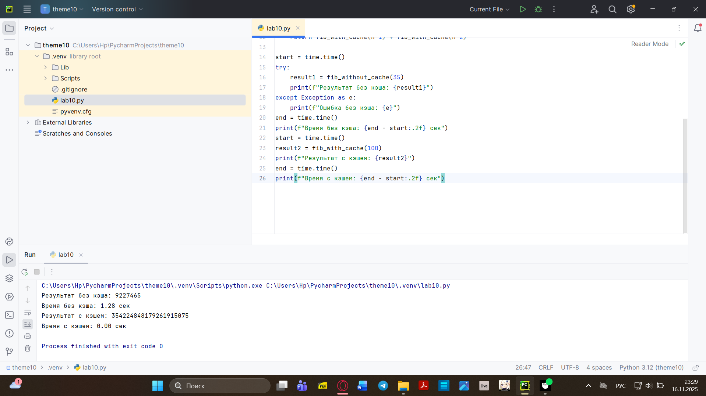
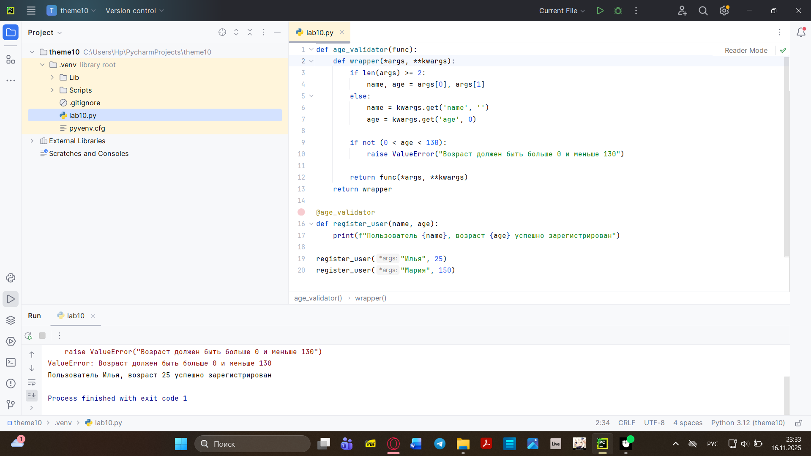
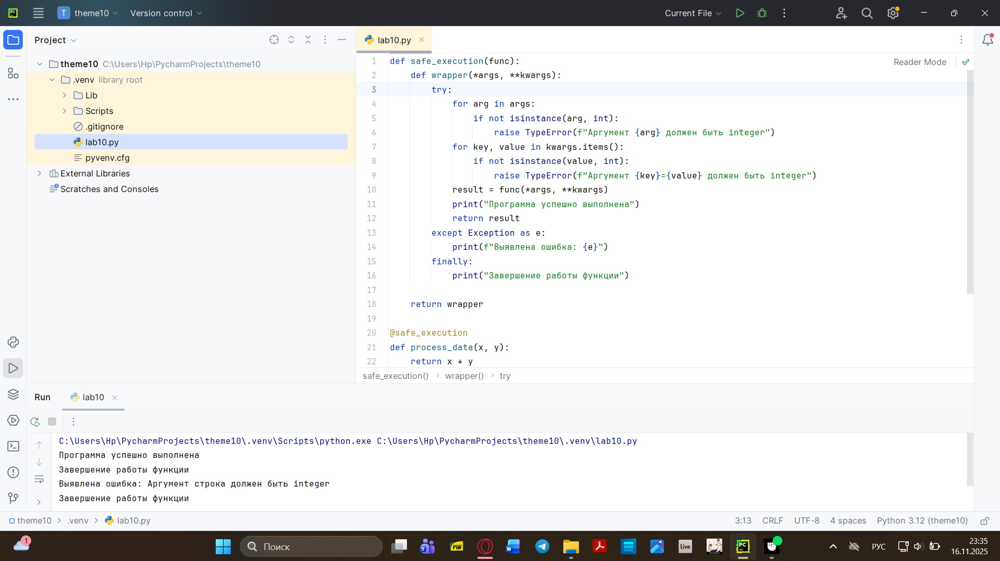
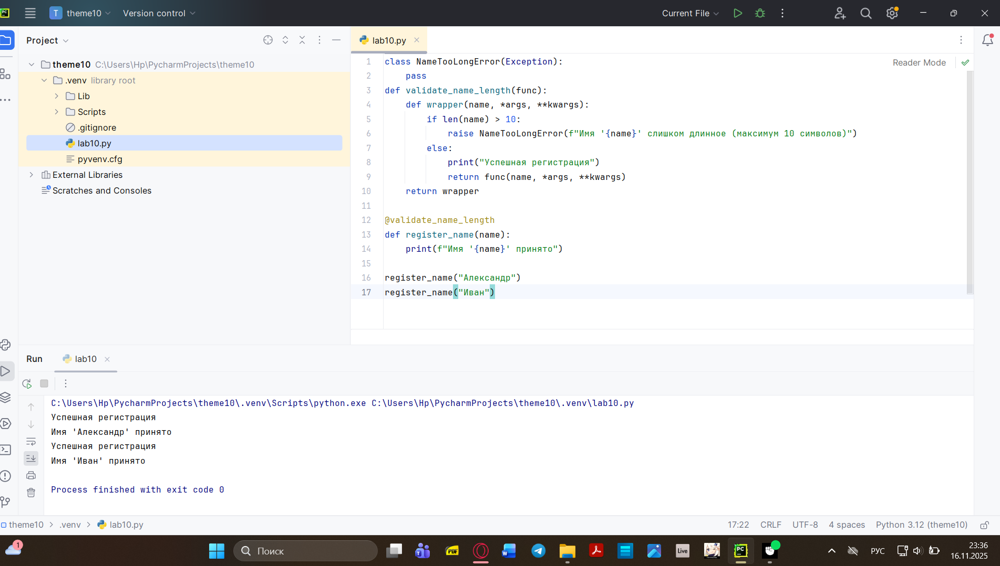
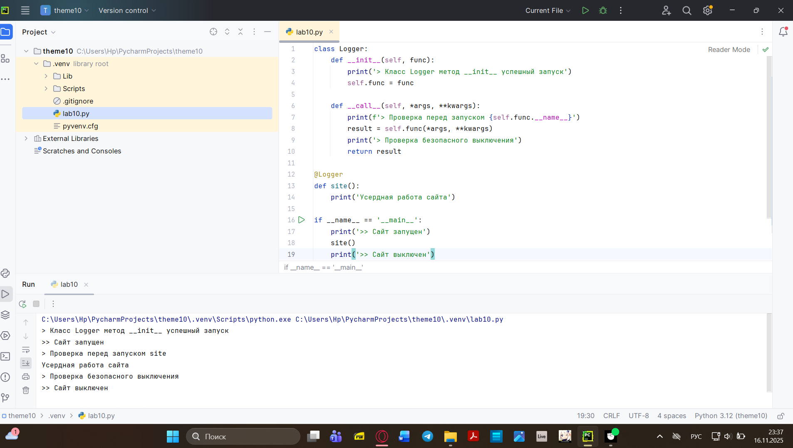
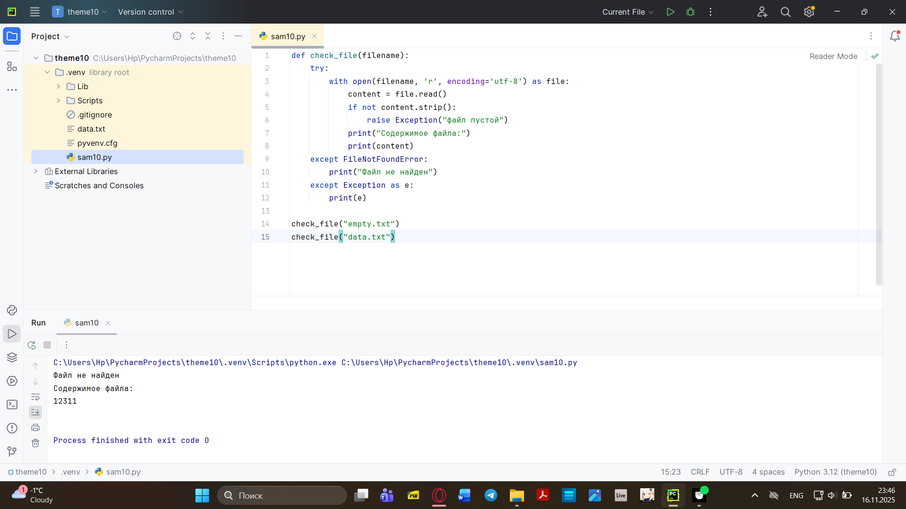
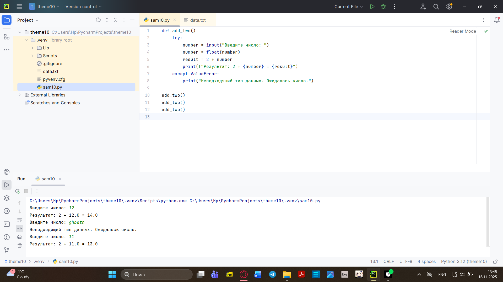
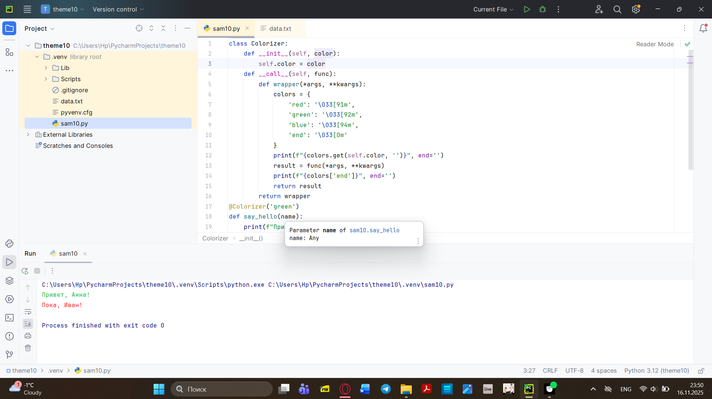
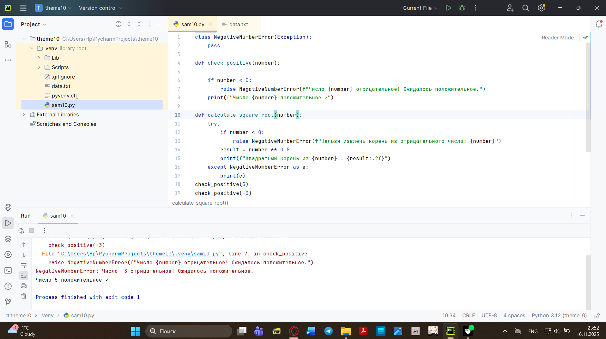

# Тема 10. Исключения и декораторы.
Отчёт по Теме 10 выполнил:
- Хайрутдинов Линар Рустамович
- Группа: АИС-23-1
  
| Задание     | Лаб_Раб     | Сам_Раб     | 
| ----------- | ----------- | ----------- |
|  Задание 1  |     +       |      +      |
|  Задание 2  |     +       |      +      | 
|  Задание 3  |     +       |      +      | 
|  Задание 4  |     +       |      +      | 
|  Задание 5  |     +       |      +      |  

# Лабораторные работа 1

```python
from functools import lru_cache
import time
def fib_without_cache(n):
    if n < 2:
        return n
    return fib_without_cache(n-1) + fib_without_cache(n-2)

@lru_cache(maxsize=None)
def fib_with_cache(n):
    if n < 2:
        return n
    return fib_with_cache(n-1) + fib_with_cache(n-2)

start = time.time()
try:
    result1 = fib_without_cache(35)
    print(f"Результат без кэша: {result1}")
except Exception as e:
    print(f"Ошибка без кэша: {e}")
end = time.time()
print(f"Время без кэша: {end - start:.2f} сек")
start = time.time()
result2 = fib_with_cache(100)
print(f"Результат с кэшем: {result2}")
end = time.time()
print(f"Время с кэшем: {end - start:.2f} сек")
```
### Результат


# Лабораторные работа 2

```python
def age_validator(func):
    def wrapper(*args, **kwargs):
        if len(args) >= 2:
            name, age = args[0], args[1]
        else:
            name = kwargs.get('name', '')
            age = kwargs.get('age', 0)

        if not (0 < age < 130):
            raise ValueError("Возраст должен быть больше 0 и меньше 130")

        return func(*args, **kwargs)
    return wrapper

@age_validator
def register_user(name, age):
    print(f"Пользователь {name}, возраст {age} успешно зарегистрирован")

register_user("Илья", 25)
register_user("Мария", 150)
```

### Результат


# Лабораторные работа 3

```python
def safe_execution(func):
    def wrapper(*args, **kwargs):
        try:
            for arg in args:
                if not isinstance(arg, int):
                    raise TypeError(f"Аргумент {arg} должен быть integer")
            for key, value in kwargs.items():
                if not isinstance(value, int):
                    raise TypeError(f"Аргумент {key}={value} должен быть integer")
            result = func(*args, **kwargs)
            print("Программа успешно выполнена")
            return result
        except Exception as e:
            print(f"Выявлена ошибка: {e}")
        finally:
            print("Завершение работы функции")

    return wrapper

@safe_execution
def process_data(x, y):
    return x + y
process_data(10, 20)
process_data(10, "строка")
```
### Результат


# Лабораторные работа 4

```python
class NameTooLongError(Exception):
    pass
def validate_name_length(func):
    def wrapper(name, *args, **kwargs):
        if len(name) > 10:
            raise NameTooLongError(f"Имя '{name}' слишком длинное (максимум 10 символов)")
        else:
            print("Успешная регистрация")
            return func(name, *args, **kwargs)
    return wrapper

@validate_name_length
def register_name(name):
    print(f"Имя '{name}' принято")

register_name("Александр")
register_name("Иван")
```

### Результат


# Лабораторные работа 5
```python
class Logger:
    def __init__(self, func):
        print('> Класс Logger метод __init__ успешный запуск')
        self.func = func

    def __call__(self, *args, **kwargs):
        print(f'> Проверка перед запуском {self.func.__name__}')
        result = self.func(*args, **kwargs)
        print('> Проверка безопасного выключения')
        return result

@Logger
def site():
    print('Усердная работа сайта')

if __name__ == '__main__':
    print('>> Сайт запущен')
    site()
    print('>> Сайт выключен')
```
### Результат


# Самостоятельная работа 1

```python
import time


def timer(func):
    def wrapper():
        start = time.time()
        func()
        end = time.time()
        print(f"\nВремя выполнения: {end - start:.4f} секунд")

    return wrapper


@timer
def fibonacci():
    fib1 = fib2 = 1
    print(fib1, fib2, end=' ')

    for i in range(2, 200):
        fib1, fib2 = fib2, fib1 + fib2
        print(fib2, end=' ')


if __name__ == '__main__':
    fibonacci()
```
###Результат
# Самостоятельная работа 2
```python
def check_file(filename):
    try:
        with open(filename, 'r', encoding='utf-8') as file:
            content = file.read()
            if not content.strip():
                raise Exception("файл пустой")
            print("Содержимое файла:")
            print(content)
    except FileNotFoundError:
        print("Файл не найден")
    except Exception as e:
        print(e)

check_file("empty.txt")
check_file("data.txt")

```
###Результат

# Самостоятельная работа 3
```python
def add_two():
    try:
        number = input("Введите число: ")
        number = float(number)
        result = 2 + number
        print(f"Результат: 2 + {number} = {result}")
    except ValueError:
        print("Неподходящий тип данных. Ожидалось число.")

add_two()
add_two()
add_two()

```
###Результат


# Самостоятельная работа 4
```python
class Colorizer:
    def __init__(self, color):
        self.color = color
    def __call__(self, func):
        def wrapper(*args, **kwargs):
            colors = {
                'red': '\033[91m',
                'green': '\033[92m',
                'blue': '\033[94m',
                'end': '\033[0m'
            }
            print(f"{colors.get(self.color, '')}", end='')
            result = func(*args, **kwargs)
            print(f"{colors['end']}", end='')
            return result
        return wrapper
@Colorizer('green')
def say_hello(name):
    print(f"Привет, {name}!")
@Colorizer('red')
def say_bye(name):
    print(f"Пока, {name}!")
say_hello("Анна")
say_bye("Иван")
```
###Результат


# Самостоятельная работа 5
```python
class NegativeNumberError(Exception):
    pass

def check_positive(number):

    if number < 0:
        raise NegativeNumberError(f"Число {number} отрицательное! Ожидалось положительное.")
    print(f"Число {number} положительное ✓")

def calculate_square_root(number):
    try:
        if number < 0:
            raise NegativeNumberError(f"Нельзя извлечь корень из отрицательного числа: {number}")
        result = number ** 0.5
        print(f"Квадратный корень из {number} = {result:.2f}")
    except NegativeNumberError as e:
        print(e)
check_positive(5)
check_positive(-3)

calculate_square_root(16)
calculate_square_root(-9)
```
###Результат



