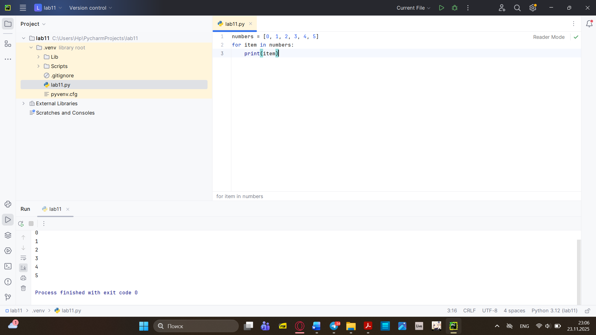
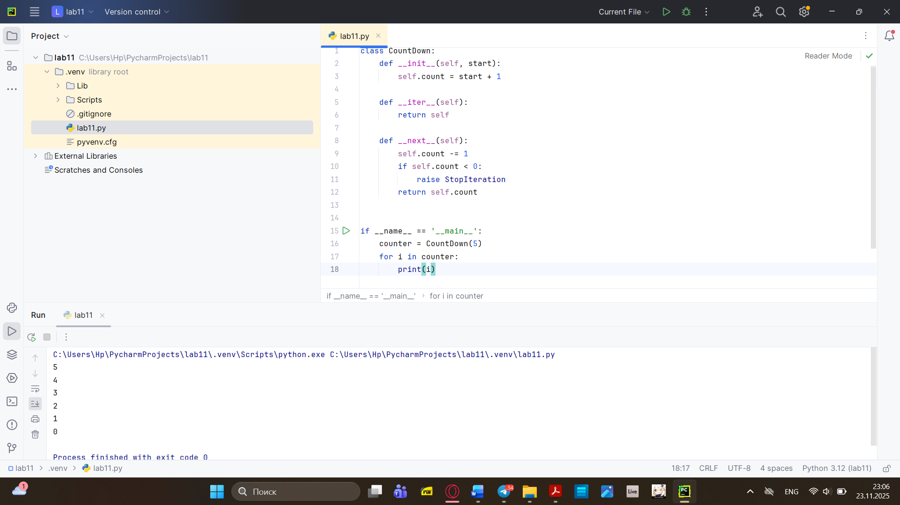
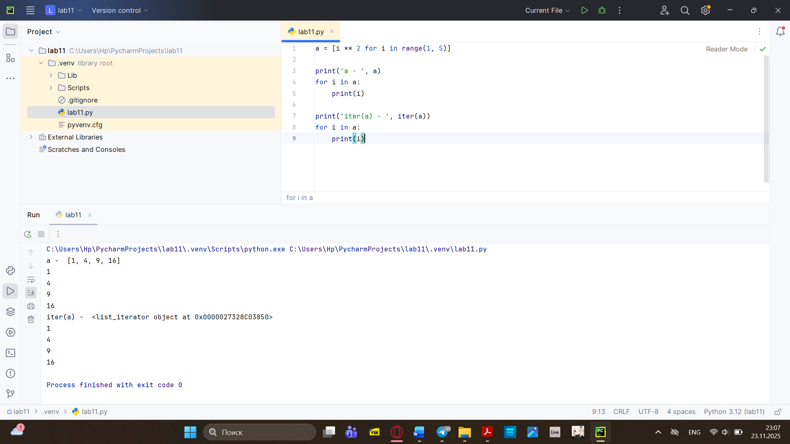
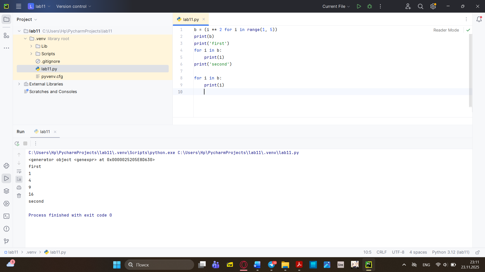
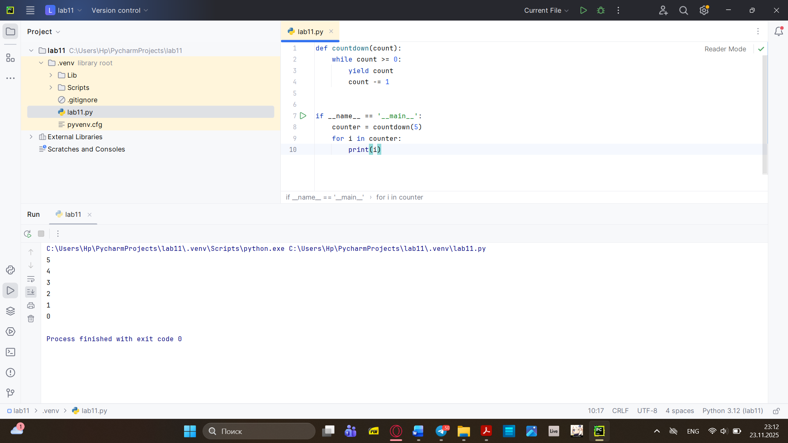
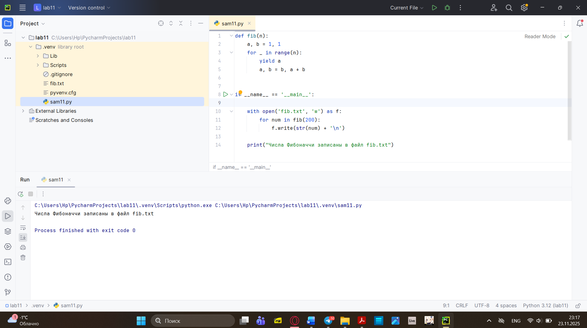

# Тема 11. Итераторы и генераторы.
Отчёт по Теме 11 выполнил:
- Хайрутдинов Линар Рустамович
- Группа: АИС-23-1
  
| Задание     | Лаб_Раб     | Сам_Раб     | 
| ----------- | ----------- | ----------- |
|  Задание 1  |     +       |      +      |
|  Задание 2  |     +       |      +      | 
|  Задание 3  |     +       |             
|  Задание 4  |     +       |             
|  Задание 5  |     +       |              

# Лабораторные работа 1

```python
numbers = [0, 1, 2, 3, 4, 5]
for item in numbers:
    print(item)
```
### Результат


# Лабораторные работа 2

```python
class CountDown:
    def __init__(self, start):
        self.count = start + 1

    def __iter__(self):
        return self

    def __next__(self):
        self.count -= 1
        if self.count < 0:
            raise StopIteration
        return self.count


if __name__ == '__main__':
    counter = CountDown(5)
    for i in counter:
        print(i)
```

### Результат


# Лабораторные работа 3

```python
a = [i ** 2 for i in range(1, 5)]

print('a - ', a)
for i in a:
    print(i)

print('iter(a) - ', iter(a))
for i in a:
    print(i)
```
### Результат


# Лабораторные работа 4

```python
b = (i ** 2 for i in range(1, 5))
print(b)
print('first')
for i in b:
    print(i)
print('second')

for i in b:
    print(i)
```

### Результат


# Лабораторные работа 5
```python
def countdown(count):
    while count >= 0:
        yield count
        count -= 1


if __name__ == '__main__':
    counter = countdown(5)
    for i in counter:
        print(i)
```
### Результат


# Самостоятельная работа 1

```python
def fib(n):
    a, b = 1, 1
    for _ in range(n):
        yield a
        a, b = b, a + b


if __name__ == '__main__':
    for num in fib(200):
        print(num)
```
###Результат
# Самостоятельная работа 2
```python
def fib(n):
    a, b = 1, 1
    for _ in range(n):
        yield a
        a, b = b, a + b


if __name__ == '__main__':

    with open('fib.txt', 'w') as f:
        for num in fib(200):
            f.write(str(num) + '\n')

    print("Числа Фибоначчи записаны в файл fib.txt")
```
###Результат


