# Тема 7. Работа с файлами (ввод, вывод)
Отчёт по Теме 7 выполнил:
- Хайрутдинов Линар Рустамович
- Группа: АИС-23-1
  
| Задание     | Лаб_Раб     | Сам_Раб     | 
| ----------- | ----------- | ----------- |
|  Задание 1  |     +       |    +       |
|  Задание 2  |     +       |    +       |
|  Задание 3  |     +       |    +       |
|  Задание 4  |     +       |    +       |
|  Задание 5  |     +       |    +       |
|  Задание 6  |     +       |           |
|  Задание 7  |     +       |           |
|  Задание 8  |     +       |           |
|  Задание 9  |     +       |           |
|  Задание 10 |    +        |           |

# Лабораторные работа 1
## Составьте текстовый файл и положите его в одну директорию с программой на Python. Текстовый файл должен состоять минимум из двух строк.

```
Ayoo everybody
Close the door, please ;)
```

### Результат
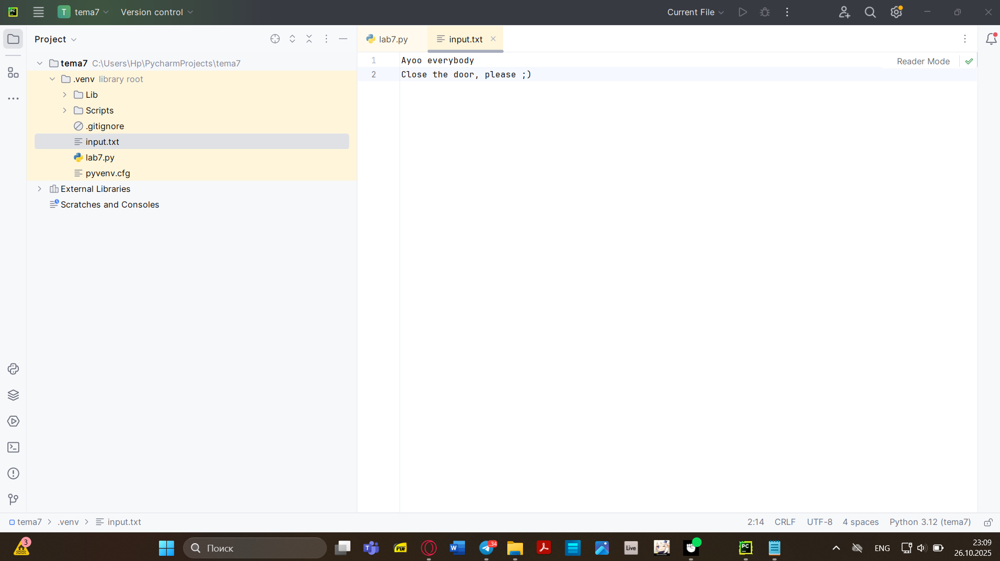


# Лабораторные работа 2
## Напишите программу, которая выведет только первую строку из вашего файла, при этом используйте конструкцию open()/close().

```python
f = open('input.txt', 'r')
print(f.readline())
f.close()
```

### Результат
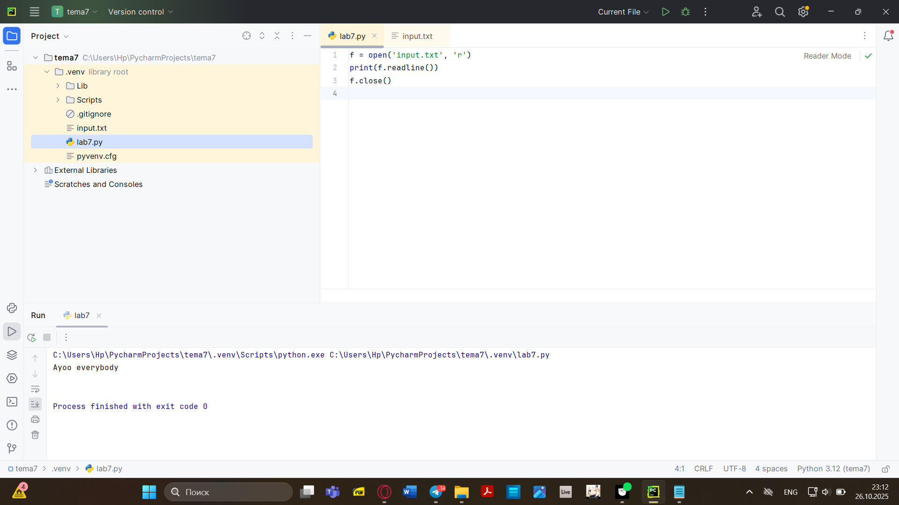

# Лабораторные работа 3
## Напишите программу, которая выведет все строки из вашего файла в массиве, при этом используйте конструкцию open()/close().

```python
f = open('input.txt', 'r')
print(f.readlines())
f.close()
```

### Результат
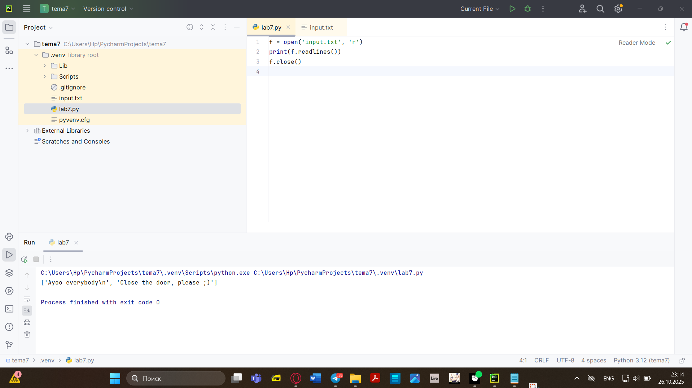

# Лабораторные работа 4
##

```python
with open('input.txt') as f:
    print(f.readlines())
```

### Результат
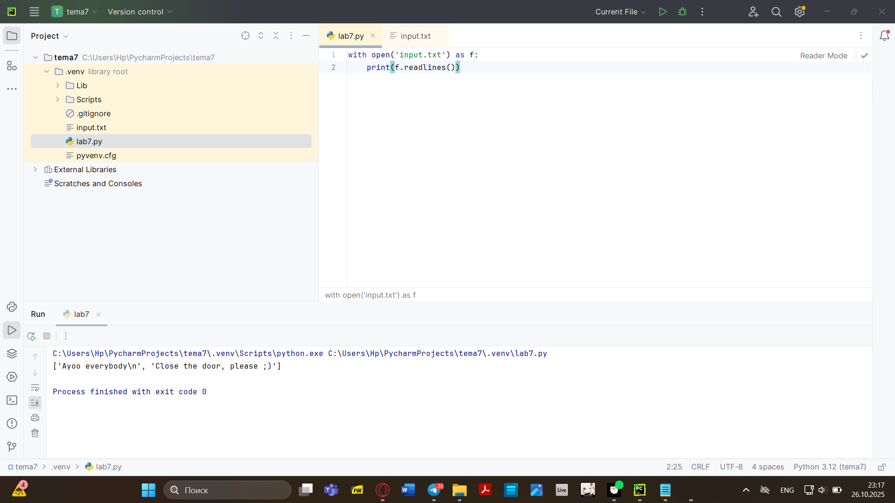

# Лабораторные работа 5
## Напишите программу, которая выведет каждую строку из вашего файла отдельно, при этом используйте конструкцию with open().
```python
with open('input.txt') as f:
    for line in f:
        print(line)
```

### Результат
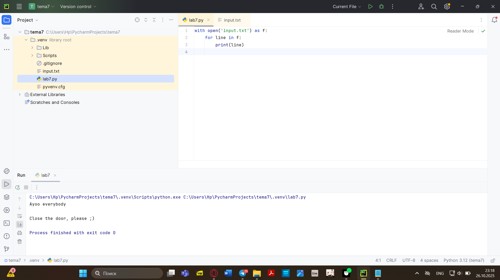

# Лабораторные работа 6
## Напишите программу, которая будет добавлять новую строку в ваш файл, а потом выведет полученный файл в консоль. Вывод можно осуществлять любым способом. Обязательно проверьте сам файл, чтобы изменения в нем тоже отображались.
```python
with open('input.txt', 'a+') as f:
    f.write('\n Ugh Ugh, Get out!')

with open('input.txt', 'r') as f:
    result = f.readlines()
    print(result)
```

### Результат
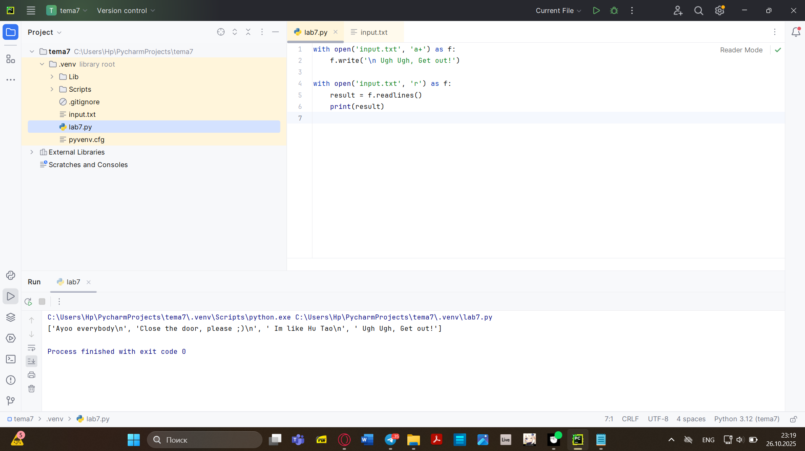

# Лабораторные работа 7
## Напишите программу, которая перепишет всю информацию, которая была у вас в файле до этого, например напишет любые данные из произвольно вами составленного списка. Также не забудьте проверить что измененная вами информация сохранилась в файле.
```python
owo = ['One','two','three']
with open ('input.txt', 'w') as f:
    for line in owo:
        f.write('\nCycle run ' + line)
    print('Готово.')

```

### Результат
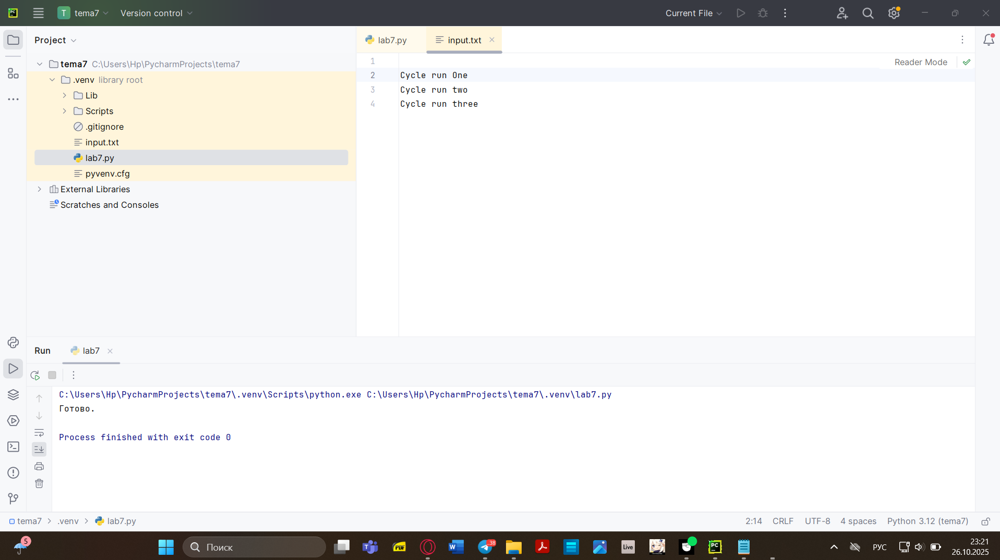

# Лабораторные работа 8
## 
```python
import os

def print_docs(directory):
    all_files = os.walk(directory)
    for catalog in all_files:
        print(f'Папка {catalog[0]} Содержит: ')
    print(f'Директорies: {"," .join([folder for folder in catalog[1]])}')
    print(f'Файles: {"," .join([file for file in catalog[2]])}')

print_docs('C:/Users/Hp/OneDrive/Рабочий стол/pe/theme3')

```

### Результат
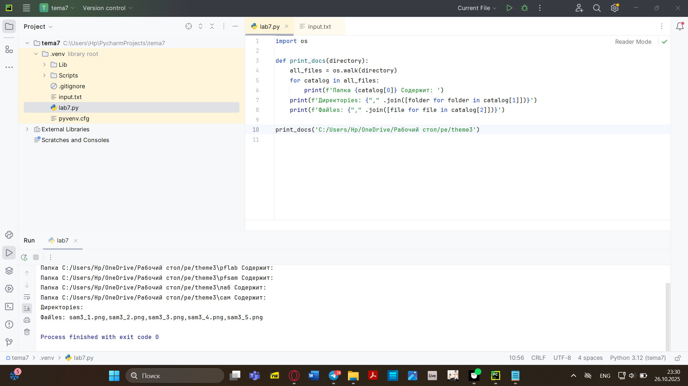


# Лабораторные работа 9
## 
```python
def longest_words(file):
    with open(file, encoding='utf-8') as f:
        words = f.read().split()
        max_length = len(max(words, key=len))
        for word in words:
            if len(word) == max_length:
                sought_word = word

        if len(sought_word) == 1:
            return sought_word[0]
        return sought_word

print(longest_words('input.txt'))

```

### Результат
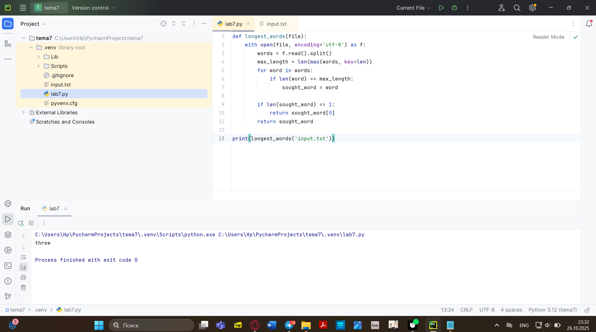
# Лабораторные работа 10
## 
```python
import csv
import datetime
import time

with open("rows_300.csv",'w', encoding='utf-8', newline='') as f:
    writer = csv.writer(f)
    writer.writerow(['№','Секунда', 'Микросекунда'])
    for line in range(1,301):
        writer.writerow([line, datetime.datetime.now().second, datetime.datetime.now().microsecond])
        time.sleep(0.01)
```

### Результат
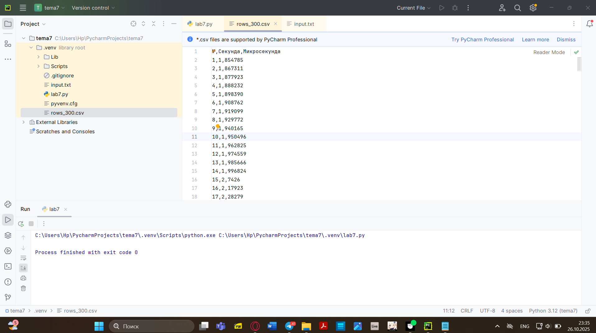

# Самостоятельная работа 1
## Найдите в интернете любую статью (объем статьи не менее 200 слов), скопируйте ее содержимое в файл и напишите программу, которая считает количество слов в текстовом файле и определит самое часто встречающееся слово. Результатом выполнения задачи будет: скриншот файла со статьей, листинг кода, и вывод в консоль, в котором будет указана вся необходимая информация. 

```python
from collections import Counter
import re

with open("statia.txt", "r", encoding="utf-8") as file:
    text = file.read()

words = re.findall(r'\b\w+\b', text.lower())
word_count = len(words)
most_common_word, count = Counter(words).most_common(1)[0]

print(f"Общее количество слов: {word_count} ")
print(f"Самое частое слово: '{most_common_word}' (встречается {count} раз)")
```

### Результат
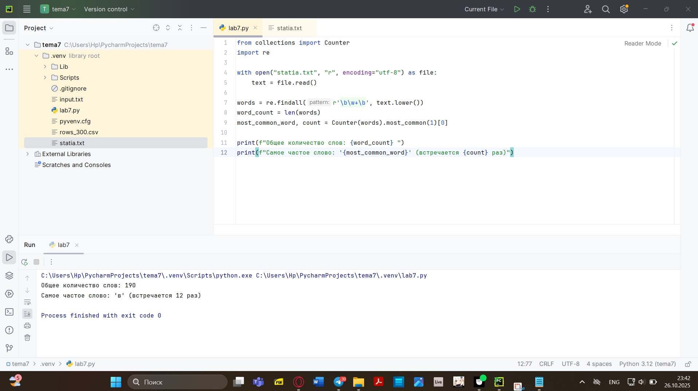
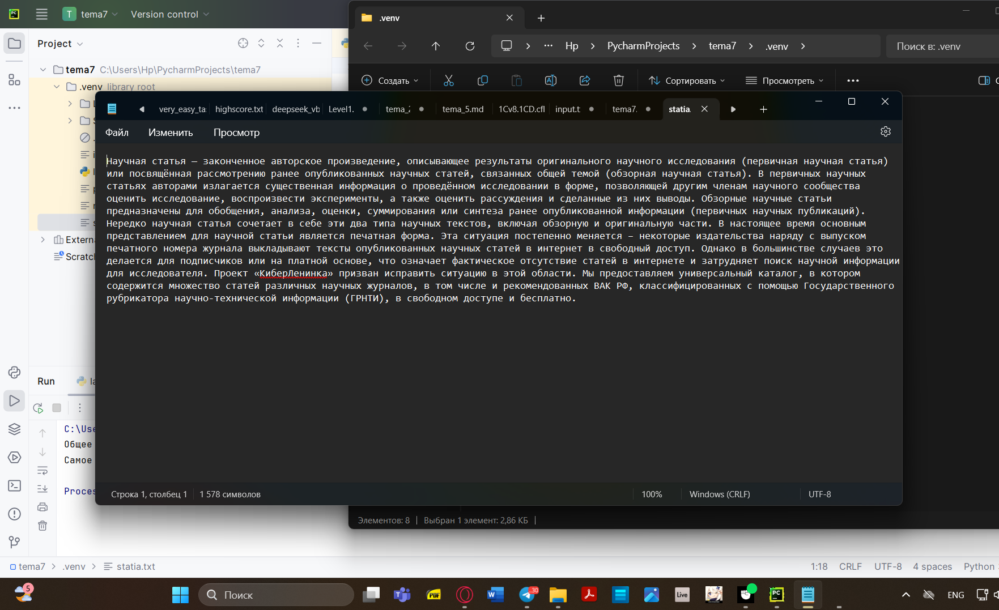


### Вывод
Анализирует текстовый файл, подсчитывает общее количество слов и определяет наиболее часто встречающееся слово обрабатывая текст на русском языке, игнорируя знаки препинания. 

# Самостоятельная работа 2
## У вас появилась потребность в ведении книги расходов, посмотрев все существующие варианты вы пришли к выводу что вас ничего не устраивает и нужно все делать самому. Напишите программу для учета расходов. Программа должна позволять вводить информацию о расходах, сохранять ее в файл и выводить существующие данные в консоль. Ввод информации происходит через консоль. Результатом выполнения задачи будет: скриншот файла с учетом расходов, листинг кода, и вывод в консоль, с демонстрацией работоспособности программы.

```python
def add_expense():
    amount = input("Введите сумму расхода: ")
    category = input("Введите категорию расхода: ")
    with open("rashod.txt", "a", encoding="utf-8") as file:
        file.write(f"{amount} {category}\n")

def show_expenses():
    try:
        with open("rashod.txt", "r", encoding="utf-8") as file:
            print("История расходов:")
            for line in file:
                print(line.strip())
    except FileNotFoundError:
        print("Файл с расходами пуст.")

while True:
    action = input("1 - Добавить расход, 2 - Показать расходы, 3 - Выход: ")
    if action == "1":
        add_expense()
    elif action == "2":
        show_expenses()
    elif action == "3":
        break
```

### Результат
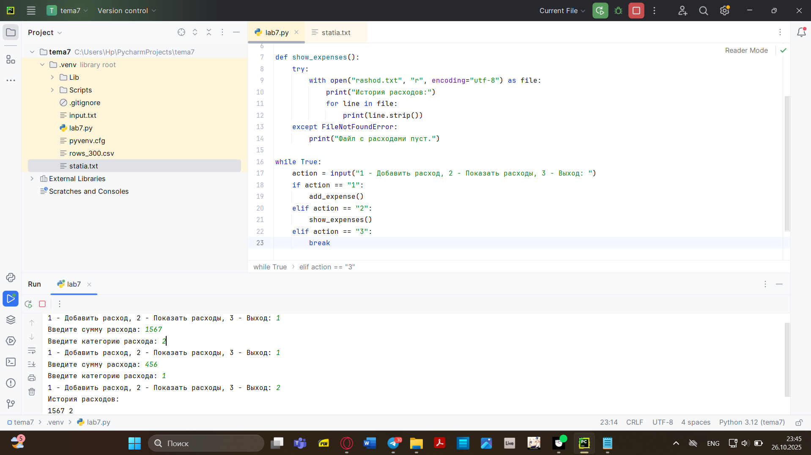

### Вывод
Реализована простая система учёта расходов. Программа обеспечивает создание и чтение записей через консольный интерфейс. Данные persistently сохраняются в файле, что позволяет вести долговременный учёт. 

# Самостоятельная работа 3
## Имеется файл input.txt с текстом на латинице. Напишите программу, которая выводит следующую статистику по тексту: количество букв латинского алфавита; число слов; число строк.

```python
with open("input.txt", "r", encoding="utf-8") as file:
    lines = file.readlines()

letter_count = sum(len([ch for ch in line if ch.isalpha()]) for line in lines)
word_count = sum(len(line.split()) for line in lines)
line_count = len(lines)

print("Входной файл содержит:")
print(f"{letter_count} букв")
print(f"{word_count} слов")
print(f"{line_count} строк")
```

### Результат
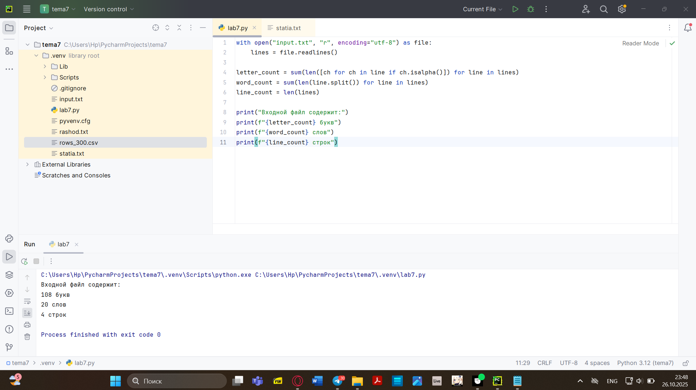

### Вывод
Программа анализирует  файл, подсчитывая количество букв, слов и строк. Алгоритм учитывает только буквенные символы.

# Самостоятельная работа 4
## Напишите программу, которая получает на вход предложение, выводит его в терминал, заменяя все запрещенные слова звездочками * (количество звездочек равно количеству букв в слове). Запрещенные слова, разделенные символом пробела, хранятся в текстовом файле input.txt. Все слова в этом файле записаны в нижнем регистре. Программа должна заменить запрещенные слова, где бы они ни встречались, даже в середине другого слова. Замена производится независимо от регистра: если
файл input.txt содержит запрещенное слово exam, то слова exam, Exam, ExaM, EXAM и exAm должны быть заменены на ****. Запрещенные слова: hello email python the exam wor is

```python
def load_forbidden_words(filename):
    try:
        with open(filename, 'r', encoding='utf-8') as file:
            content = file.read().strip()
            return content.split()
    except FileNotFoundError:
        print(f"Файл {filename} не найден")
        return []


def censor_text(text, forbidden_words):
    result = text

    for word in forbidden_words:

        start = 0
        while True:

            index = result.lower().find(word.lower(), start)
            if index == -1:
                break

            original_word = result[index:index + len(word)]

            stars = '*' * len(original_word)
            result = result[:index] + stars + result[index + len(word):]

            start = index + len(stars)

    return result


def main():
    forbidden_words = load_forbidden_words('input.txt')

    test_text = """Hello, world! Python IS the programming language of thE future. 
My EMAIL is....
PYTHON is awesome!!!!"""

    censored_text = censor_text(test_text, forbidden_words)

    print(censored_text)


if __name__ == "__main__":
    main()
```

### Результат
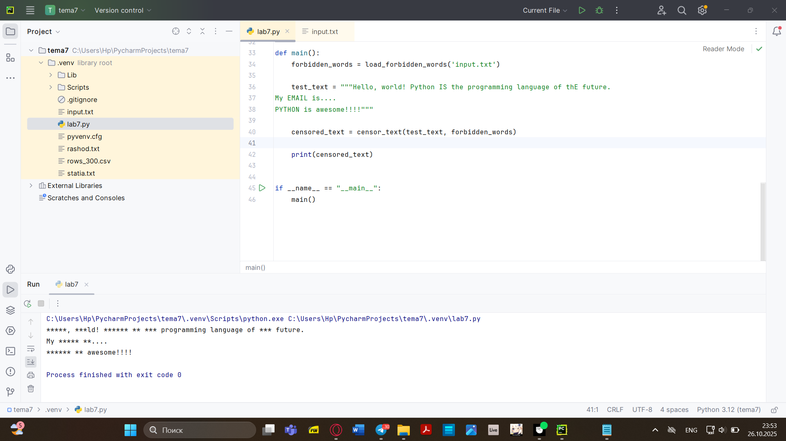


### Вывод
Разработан фильтр контента, который заменяет запрещённые слова на звёздочки независимо от регистра.
# Самостоятельная работа 5
## Самостоятельно придумайте и решите задачу, которая будет взаимодействовать с текстовым файлом.

```python
def load_forbidden_words(filename):
    try:
        with open(filename, 'r', encoding='utf-8') as file:
            content = file.read().strip()
            return content.split()
    except FileNotFoundError:
        print(f"Файл {filename} не найден")
        return []
def censor_text(text, forbidden_words):
    result = text
    for word in forbidden_words:
        start = 0
        while True:
            index = result.lower().find(word.lower(), start)
            if index == -1:
                break
            original_word = result[index:index + len(word)]
            stars = '*' * len(original_word)
            result = result[:index] + stars + result[index + len(word):]
            start = index + len(stars)
    return result
def show_tasks():
    try:
        with open('tasks.txt', 'r', encoding='utf-8') as file:
            tasks = file.readlines()
            if not tasks:
                print("Список дел пуст!")
            else:
                print("\n--- Мой список дел ---")
                for i, task in enumerate(tasks, 1):
                    print(f"{i}. {task.strip()}")
    except FileNotFoundError:
        print("Список дел пуст!")
def add_task():
    task = input("Введите новую задачу: ")
    with open('tasks.txt', 'a', encoding='utf-8') as file:
        file.write(task + '\n')
    print("Задача добавлена!")
def clear_tasks():
    confirm = input("Вы уверены, что хотите очистить весь список? (да/нет): ")
    if confirm.lower() == 'да':
        with open('tasks.txt', 'w', encoding='utf-8') as file:
            pass
        print("Список очищен!")
    else:
        print("Очистка отменена.")
def main():
    while True:
        print("\n=== Меню списка дел ===")
        print("1. Показать задачи")
        print("2. Добавить задачу")
        print("3. Очистить список")
        print("4. Выйти")
        choice = input("Выберите действие (1-4): ")
        if choice == '1':
            show_tasks()
        elif choice == '2':
            add_task()
        elif choice == '3':
            clear_tasks()
        elif choice == '4':
            print("До свидания!")
            break
        else:
            print("Неверный выбор! Попробуйте снова.")
if __name__ == "__main__":
    main()
```

### Результат
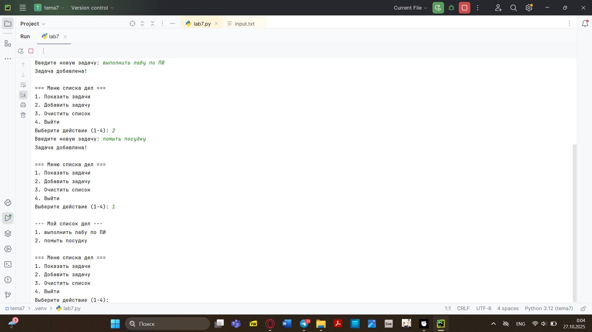


### Вывод
Программа работает корректно, выполняя все функции стабильно

# Общий вывод
В процессе решения освоены: Базовые операции с файлами - чтение, запись, добавление данных. Обработка текстовой информации - анализ, фильтрация, модификация. Работа с структурированными данными - сохранение и извлечение информации в определённом формате. Создание интерактивных консольных приложений - взаимодействие с пользователем через терминал.
