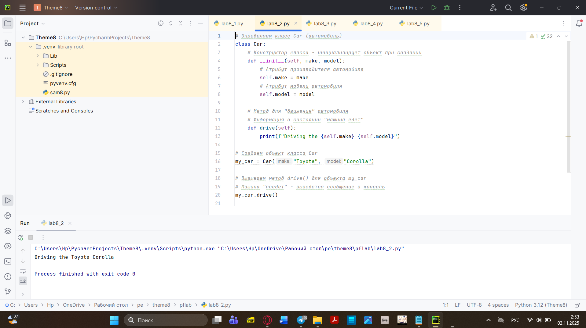
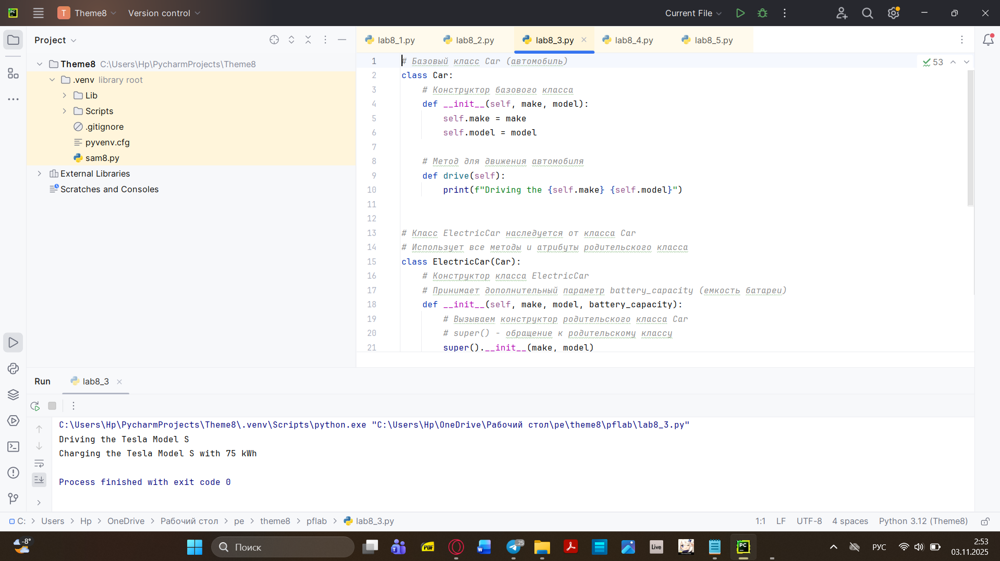
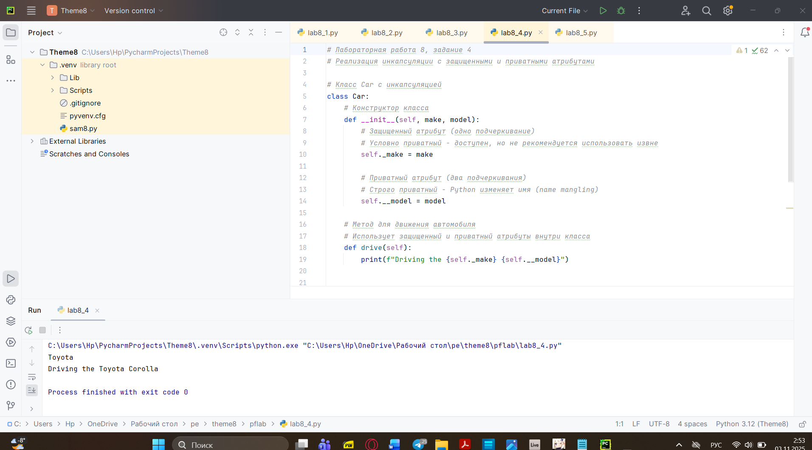
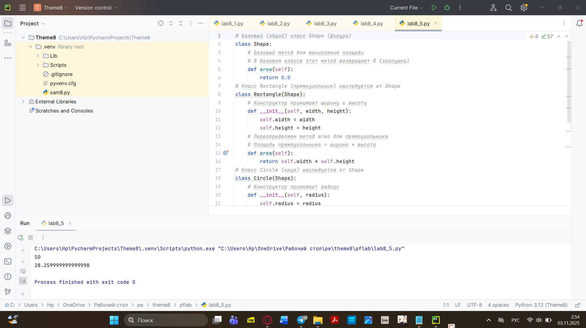
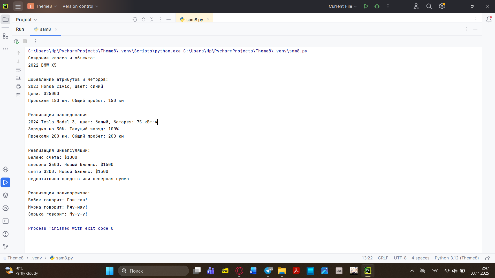

# Тема 8. Работа с файлами (ввод, вывод)
Отчёт по Теме 8 выполнил:
- Хайрутдинов Линар Рустамович
- Группа: АИС-23-1
  
| Задание     | Лаб_Раб     | Сам_Раб     | 
| ----------- | ----------- | ----------- |
|  Задание 1  |     +       |    +       |
|  Задание 2  |     +       |    +       |
|  Задание 3  |     +       |    +       |
|  Задание 4  |     +       |    +       |
|  Задание 5  |     +       |    +       |

# Лабораторные работа 1
## Создание класса "Car" с атрибутами производитель и модель

```
# Определяем класс Car (автомобиль)
class Car:
    # Конструктор класса - метод, который вызывается при создании объекта
    # self - ссылка на текущий объект
    # make - производитель автомобиля
    # model - модель автомобиля
    def __init__(self, make, model):
        # Сохраняем производителя в атрибут объекта
        self.make = make
        # Сохраняем модель в атрибут объекта
        self.model = model

# Создаем объект класса Car с конкретными значениями
# my_car - это экземпляр класса Car
my_car = Car("Toyota", "Corolla")
```

# Лабораторные работа 2
## Добавление атрибутов и методов класса, машина "едет"

```python
# Определяем класс Car (автомобиль)
class Car:
    # Конструктор класса - инициализирует объект при создании
    def __init__(self, make, model):
        # Атрибут производителя автомобиля
        self.make = make
        # Атрибут модели автомобиля
        self.model = model

    # Метод для имитации движения автомобиля
    # Выводит информацию о том, что машина едет
    def drive(self):
        print(f"Driving the {self.make} {self.model}")

# Создаем объект класса Car
my_car = Car("Toyota", "Corolla")

# Вызываем метод drive() для объекта my_car
# Машина "поедет" - выведется сообщение в консоль
my_car.drive()
```

### Результат


# Лабораторные работа 3
## Создание класса ElectricCar с наследованием от класса Car

```python

# Базовый класс Car (автомобиль)
class Car:
    # Конструктор базового класса
    def __init__(self, make, model):
        self.make = make
        self.model = model

    # Метод для движения автомобиля
    def drive(self):
        print(f"Driving the {self.make} {self.model}")


# Класс ElectricCar наследуется от класса Car
# Использует все методы и атрибуты родительского класса
class ElectricCar(Car):
    # Конструктор класса ElectricCar
    # Принимает дополнительный параметр battery_capacity (емкость батареи)
    def __init__(self, make, model, battery_capacity):
        # Вызываем конструктор родительского класса Car
        # super() - обращение к родительскому классу
        super().__init__(make, model)
        # Добавляем новый атрибут - емкость батареи
        self.battery_capacity = battery_capacity

    # Новый метод для зарядки электромобиля
    def charge(self):
        print(f"Charging the {self.make} {self.model} with {self.battery_capacity} kWh")


# Создаем объект класса ElectricCar
my_electric_car = ElectricCar("Tesla", "Model S", 75)

# Машина едет (используется унаследованный метод drive)
my_electric_car.drive()

# Машина заряжается (используется новый метод charge)
my_electric_car.charge()
```

### Результат


# Лабораторные работа 4
## Реализация инкапсуляции с защищенными и приватными атрибутами

```python
# Класс Car с инкапсуляцией
class Car:
    # Конструктор класса
    def __init__(self, make, model):
        # Защищенный атрибут (одно подчеркивание)
        # Условно приватный - доступен, но не рекомендуется использовать извне
        self._make = make

        # Приватный атрибут (два подчеркивания)
        # Строго приватный - Python изменяет имя (name mangling)
        self.__model = model

    # Метод для движения автомобиля
    # Использует защищенный и приватный атрибуты внутри класса
    def drive(self):
        print(f"Driving the {self._make} {self.__model}")


# Создаем объект класса Car
my_car = Car("Toyota", "Corolla")

# Доступ к защищенному атрибуту (работает, но не рекомендуется)
print(my_car._make)

# Попытка доступа к приватному атрибуту напрямую вызовет ошибку
# print(my_car.__model)  # Ошибка! Приватный атрибут не доступен

# Вызываем метод drive() - внутри класса доступны все атрибуты
my_car.drive()
```

### Результат


# Лабораторные работа 5
## Реализация полиморфизма с классами Shape, Rectangle и Circle
```python
# Базовый (общий) класс Shape (фигура)
class Shape:
    # Базовый метод для вычисления площади
    # В базовом классе этот метод возвращает 0 (заглушка)
    def area(self):
        return 0.0


# Класс Rectangle (прямоугольник) наследуется от Shape
class Rectangle(Shape):
    # Конструктор принимает ширину и высоту
    def __init__(self, width, height):
        self.width = width
        self.height = height

    # Переопределяем метод area для прямоугольника
    # Площадь прямоугольника = ширина * высота

   def area(self):
        return self.width * self.height


# Класс Circle (круг) наследуется от Shape
class Circle(Shape):
    # Конструктор принимает радиус
    def __init__(self, radius):
        self.radius = radius

    # Переопределяем метод area для круга
    # Площадь круга = π * радиус²
    def area(self):
        pi = 3.14
        return pi * self.radius * self.radius


# Создаем массив с фигурами
shapes = [
    Rectangle(5, 10),    # Прямоугольник 5x10
    Circle(3)            # Круг с радиусом 3
]

# Проходим по массиву и выводим площади фигур
# Полиморфизм: метод area() вызывается для разных типов объектов
for shape in shapes:
    print(shape.area())
```
### Результат


# Самостоятельная работа 1
## Создание собственного класса и объекта

```python
# 1. Создание класса и объекта
class Car:
    def __init__(self, brand, model, year):
        self.brand = brand
        self.model = model
        self.year = year

    def display_info(self):
        return f"{self.year} {self.brand} {self.model}"


# Создание объекта
car1 = Car("BMW", "X5", 2022)
print("Создание класса и объекта:")
print(car1.display_info())
print()


# 2. Добавление атрибутов и методов
class Car:
    def __init__(self, brand, model, year, color, price):
        self.brand = brand
        self.model = model
        self.year = year
        self.color = color
        self.price = price
        self.mileage = 0

    def display_info(self):
        return f"{self.year} {self.brand} {self.model}, цвет: {self.color}"

    def drive(self, distance):
        self.mileage += distance
        return f"Проехали {distance} км. Общий пробег: {self.mileage} км"

    def get_price(self):
        return f"Цена: ${self.price}"


# Создание объекта с новыми атрибутами
car2 = Car("Honda", "Civic", 2023, "синий", 25000)
print("Добавление атрибутов и методов:")
print(car2.display_info())
print(car2.get_price())
print(car2.drive(150))
print()


# 3. Реализация наследования
class ElectricCar(Car):
    def __init__(self, brand, model, year, color, price, battery_capacity):
        super().__init__(brand, model, year, color, price)
        self.battery_capacity = battery_capacity  # в кВт·ч
        self.charge_level = 100  # в процентах

    def charge(self, percent):
        self.charge_level = min(100, self.charge_level + percent)
        return f"Зарядка на {percent}%. Текущий заряд: {self.charge_level}%"

    def display_info(self):
        return f"{super().display_info()}, батарея: {self.battery_capacity} кВт·ч"


# Создание объекта класса-наследника
electric_car = ElectricCar("Tesla", "Model 3", 2024, "белый", 45000, 75)
print("Реализация наследования:")
print(electric_car.display_info())
print(electric_car.charge(30))
print(electric_car.drive(200))
print()


# 4. Реализация инкапсуляции
class BankAccount:
    def __init__(self, owner, initial_balance=0):
        self.owner = owner
        self.__balance = initial_balance  # приватный атрибут

    def deposit(self, amount):
        if amount > 0:
            self.__balance += amount
            return f"внесено ${amount}. Новый баланс: ${self.__balance}"
        return "сумма должна быть положительной"

    def withdraw(self, amount):
        if 0 < amount <= self.__balance:
            self.__balance -= amount
            return f"снято ${amount}. Новый баланс: ${self.__balance}"
        return "недостаточно средств или неверная сумма"

    def get_balance(self):
        return f"Баланс счета: ${self.__balance}"

    # Публичный метод для доступа к приватному атрибуту
    def check_balance(self):
        return self.__balance


# Создание объекта с инкапсуляцией
account = BankAccount("Иван Иванов", 1000)
print("Реализация инкапсуляции:")
print(account.get_balance())
print(account.deposit(500))
print(account.withdraw(200))
print(account.withdraw(2000))  # попытка снять больше чем есть
print()

# 5. Реализация полиморфизма
class Animal:
    def __init__(self, name):
        self.name = name

    def make_sound(self):
        pass


class Dog(Animal):
    def make_sound(self):
        return f"{self.name} говорит: Гав-гав!"


class Cat(Animal):
    def make_sound(self):
        return f"{self.name} говорит: Мяу-мяу!"


class Cow(Animal):
    def make_sound(self):
        return f"{self.name} говорит: Му-у-у!"


# Демонстрация полиморфизма
def animal_concert(animals):
    for animal in animals:
        print(animal.make_sound())


# Создание объектов разных классов
animals = [
    Dog("Бобик"),
    Cat("Мурка"),
    Cow("Зорька")
]

print("Реализация полиморфизма:")
animal_concert(animals)

```
###Результат


