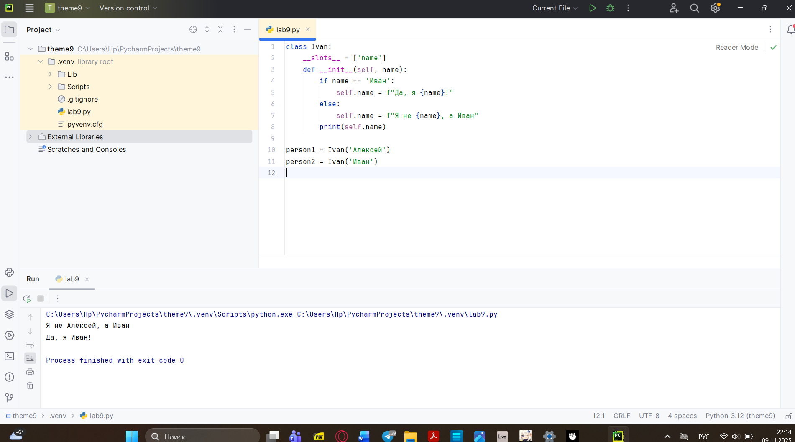
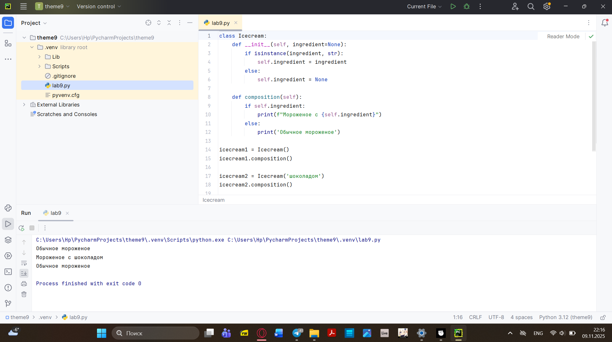
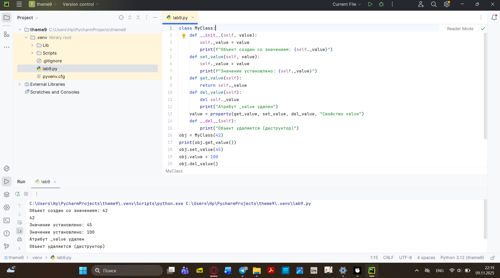
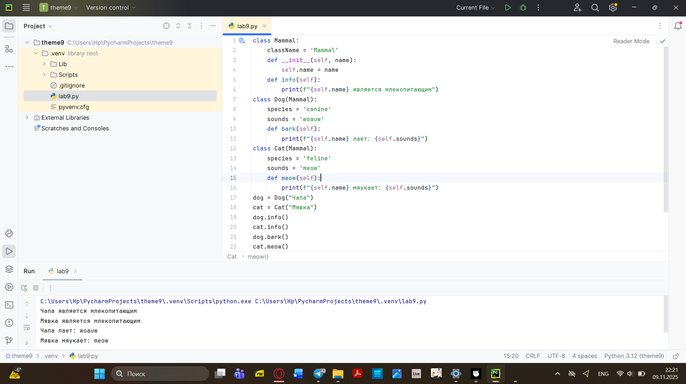
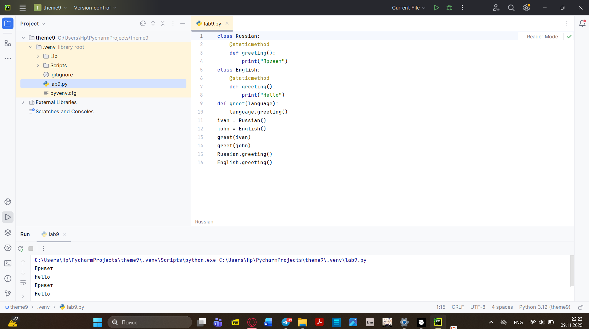
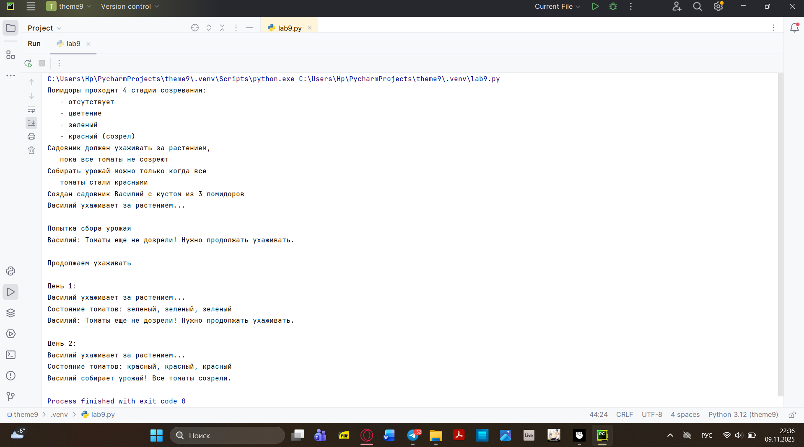

# Тема 9. Концепции и принципы ООП
Отчёт по Теме 9 выполнил:
- Хайрутдинов Линар Рустамович
- Группа: АИС-23-1
  
| Задание     | Лаб_Раб     | Сам_Раб     | 
| ----------- | ----------- | ----------- |
|  Задание 1  |     +       |      +      |
|  Задание 2  |     +       |             
|  Задание 3  |     +       |             
|  Задание 4  |     +       |             
|  Задание 5  |     +       |              

# Лабораторные работа 1

```python
class Ivan:
    __slots__ = ['name']
    def __init__(self, name):
        if name == 'Иван':
            self.name = f"Да, я {name}!"
        else:
            self.name = f"Я не {name}, а Иван"
        print(self.name)

person1 = Ivan('Алексей')
person2 = Ivan('Иван')

```
### Результат


# Лабораторные работа 2

```python
class Icecream:
    def __init__(self, ingredient=None):
        if isinstance(ingredient, str):
            self.ingredient = ingredient
        else:
            self.ingredient = None

    def composition(self):
        if self.ingredient:
            print(f"Мороженое с {self.ingredient}")
        else:
            print('Обычное мороженое')

icecream1 = Icecream()
icecream1.composition()

icecream2 = Icecream('шоколадом')
icecream2.composition()

icecream3 = Icecream(5)
icecream3.composition()
```

### Результат


# Лабораторные работа 3

```python
class MyClass:
    def __init__(self, value):
        self._value = value
        print(f"Объект создан со значением: {self._value}")
    def set_value(self, value):
        self._value = value
        print(f"Значение установлено: {self._value}")
    def get_value(self):
        return self._value
    def del_value(self):
        del self._value
        print("Атрибут _value удален")
    value = property(get_value, set_value, del_value, "Свойство value")
    def __del__(self):
        print("Объект удаляется (деструктор)")
obj = MyClass(42)
print(obj.get_value())
obj.set_value(45)
obj.value = 100
obj.del_value()
```
### Результат


# Лабораторные работа 4

```python
class Mammal:
    className = 'Mammal'
    def __init__(self, name):
        self.name = name
    def info(self):
        print(f"{self.name} является млекопитающим")
class Dog(Mammal):
    species = 'canine'
    sounds = 'woauw'
    def bark(self):
        print(f"{self.name} лает: {self.sounds}")
class Cat(Mammal):
    species = 'feline'
    sounds = 'meow'
    def meow(self):
        print(f"{self.name} мяукает: {self.sounds}")
dog = Dog("Чапа")
cat = Cat("Мявка")
dog.info()
cat.info()
dog.bark()
cat.meow()
```

### Результат


# Лабораторные работа 5
```python
class Russian:
    @staticmethod
    def greeting():
        print("Привет")
class English:
    @staticmethod
    def greeting():
        print("Hello")
def greet(language):
    language.greeting()
ivan = Russian()
john = English()
greet(ivan)
greet(john)
Russian.greeting()
English.greeting()
```
### Результат


# Самостоятельная работа 1

```python
class Tomato:
    states = {0: 'отсутствует', 1: 'цветение', 2: 'зеленый', 3: 'красный'}

    def __init__(self, index):
        self._index = index
        self._state = 0

    def grow(self):
        if self._state < 3:
            self._state += 1

    def is_ripe(self):
        return self._state == 3

    def get_state(self):
        return self.states[self._state]

class TomatoBush:
    def __init__(self, num_tomatoes):
        self.tomatoes = [Tomato(i) for i in range(num_tomatoes)]

    def grow_all(self):
        for tomato in self.tomatoes:
            tomato.grow()

    def all_are_ripe(self):
        return all(tomato.is_ripe() for tomato in self.tomatoes)

    def give_away_all(self):
        self.tomatoes = []

class Gardener:
    def __init__(self, name, plant):
        self.name = name
        self._plant = plant

    def work(self):
        print(f"{self.name} ухаживает за растением...")
        self._plant.grow_all()
    def harvest(self):
        if self._plant.all_are_ripe():
            print(f"{self.name} собирает урожай! Все томаты созрели.")
            self._plant.give_away_all()
            return True
        else:
            print(f"{self.name}: Томаты еще не дозрели")
            return False

    @staticmethod
    def knowledge_base():
        print("Помидоры проходят 4 стадии созревания:")
        print("   - отсутствует")
        print("   - цветение")
        print("   - зеленый")
        print("   - красный (созрел)")
        print("Садовник должен ухаживать за растением,")
        print("   пока все томаты не созреют")
        print("Собирать урожай можно только когда все")
        print("   томаты стали красными")

if __name__ == "__main__":
    Gardener.knowledge_base()

    bush = TomatoBush(3)
    gardener = Gardener("Василий", bush)

    print(f"Создан садовник {gardener.name} с кустом из {len(bush.tomatoes)} помидоров")
    gardener.work()
    print("\nПопытка сбора урожая")
    gardener.harvest()

    print("\nПродолжаем ухаживать")
    for day in range(1, 4):
        print(f"\nДень {day}:")
        gardener.work()
        print(f"Состояние томатов: ", end="")
        states = [tomato.get_state() for tomato in bush.tomatoes]
        print(", ".join(states))
        if gardener.harvest():
            break
    if bush.tomatoes:
        print("\nФинальная попытка сбора")
        gardener.harvest()
```
###Результат


