# Тема 5. Базовые коллекции: Строки и списки.
Отчет по Теме #5 выполнил(а):
- Хайрутдинов Линар Рустамович
- АИС-23-1

| Задание | Лаб_раб | Сам_раб |
| ------ | ------ | ------ |
| Задание 1 | + | + |
| Задание 2 | + | + |
| Задание 3 | + | + |
| Задание 4 | + | + |
| Задание 5 | + | + |
| Задание 6 | + |
| Задание 7 | + |
| Задание 8 | + |
| Задание 9 | + |
| Задание 10 | + |

знак "+" - задание выполнено; знак "-" - задание не выполнено;


## Лабораторная работа №1
### Друзья предложили вам поиграть в игру “найди отличия и убери повторения (версия для программистов)”. Суть игры состоит в том, что на вход программы поступает два множества, а ваша задача вывести все элементы первого, которых нет во втором. А вы как раз недавно прошли множества и знаете их возможности, поэтому это не составит для вас труда. P.S. Посмотрите что происходит с повторяющимися значениями в множествах, это достаточно интересно

```python
set_1 ={'White', 'Black', 'Red', 'Pink'}
set_2 = {'Red', 'Green', 'Blue', 'Red'}
print('1', set_1 - set_2)

set_1 ={'White', 'Black', 'Red', 'Pink', 'Black', 'White'}
set_2 = {'Red', 'Green', 'Blue', 'Red'}
print('2', set_1 - set_2)

set_1 ={'White', 'Black', 'Red', 'Pink', 'Red', 'Red'}
set_2 = {'Red', 'Green', 'Red', 'Red', 'Red'}
print('3', set_1 - set_2)
```
### Результат.
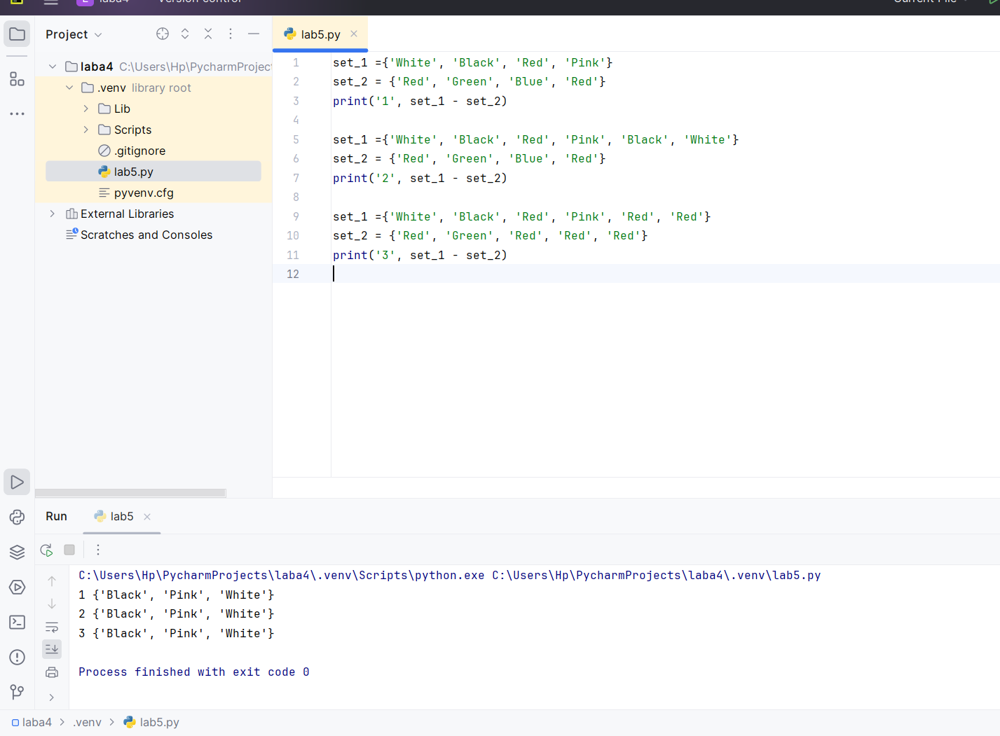

## Выводы
Разность множеств set1 - set2. Удаляет из первого множества все элементы, которые есть во втором. Дубликаты автоматически удаляются при создании множеств.
## Лабораторная работа №2
### Напишите две одинаковые программы, только одна будет использовать set(), а вторая frozenset() и попробуйте к исходному множеству добавить несколько элементов, например, через цикл
```python
a = set('abcdefg')
print(a)
for i in range(1, 5):
    a.add(i)
print(a)
```
```python
a = frozenset('abcdefg')
print(a)
for i in range(1, 5):
    a.add(i)
print(a)
```

### Результат.
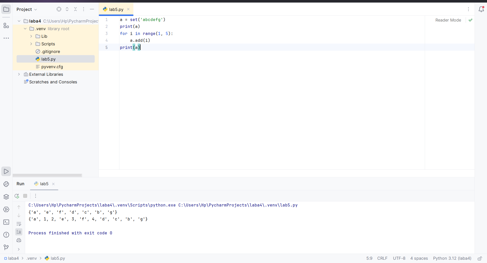
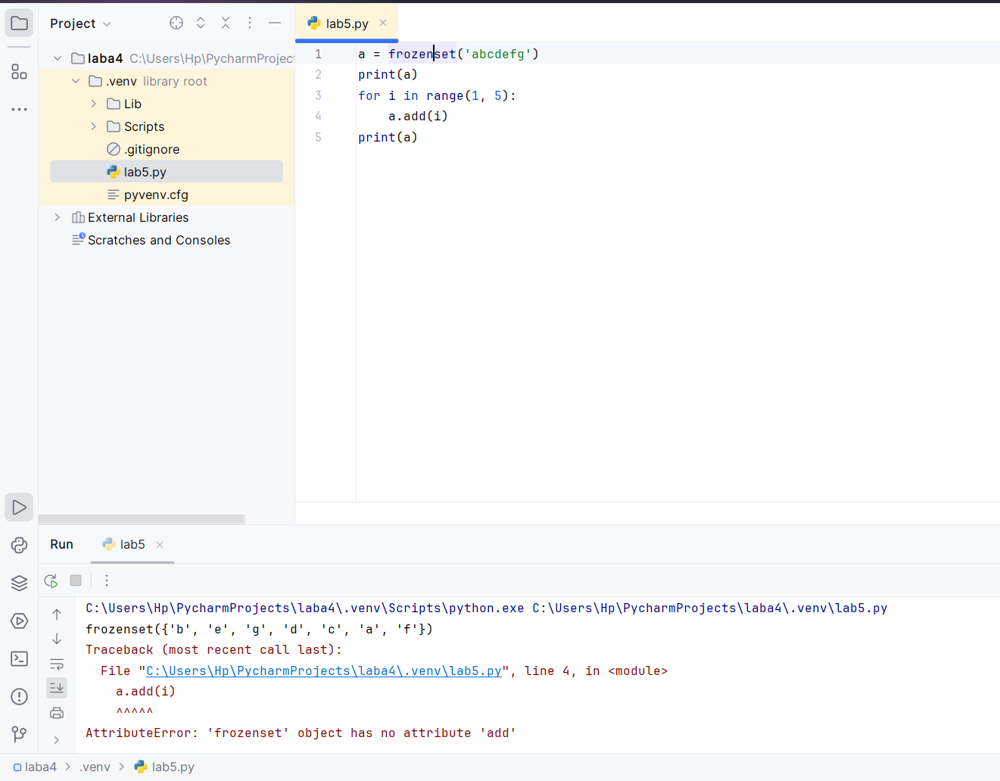
## Выводы
Создает множество из строки, затем добавляет числа 1-4. Множество mutable - можно изменять.
То же самое, но с frozenset. Вызывает ошибку при попытке добавления, так как frozenset неизменяем.

## Лабораторная работа №3
### На вход в программу поступает список (минимальной длиной 2 символа). Напишите программу, которая будет менять первый и последний элемент списка. P.S. В Python есть прикольное свойство, благодаря которому эту задачу можно решить более красиво, использовав всего 2 сточки кода, если интересно можете самостоятельно найти это решение.
```python
def replace(input_list):
    memory = input_list[0]
    input_list[0] = input_list[-1]
    input_list[-1] = memory

    return input_list
print(replace([1, 2, 3, 4, 5]))
```
### Результат.
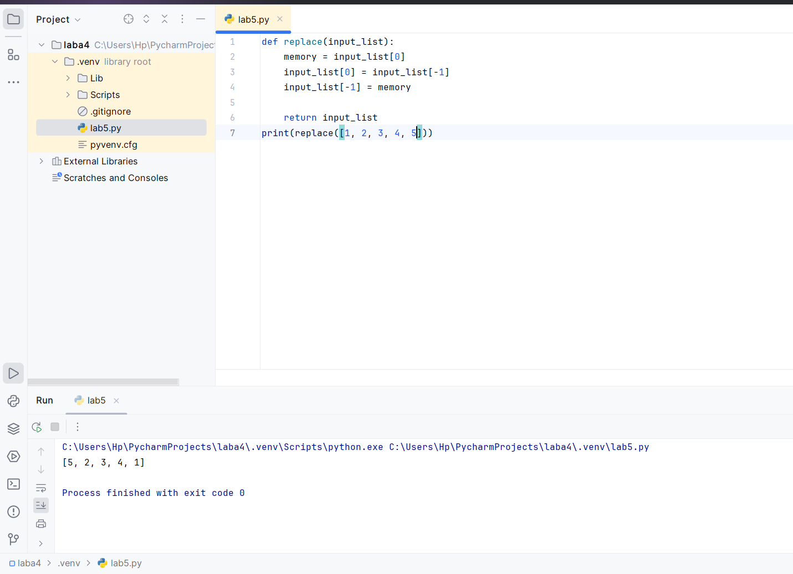
## Выводы
Функция заменяет местами первый и последний элемент списка через временную переменную memory.
## Лабораторная работа №4
### На вход в программу поступает список (минимальной длиной 10 символов). Напишите программу, которая выводит элементы с индексами от 2 до 6. В программе необходимо использовать “срез”
```python
a = [15, 22, 36, 47, 58, 69, 112, 135, 158, 146, 168, 169, 211]
print(a[2:6])
```
### Результат.
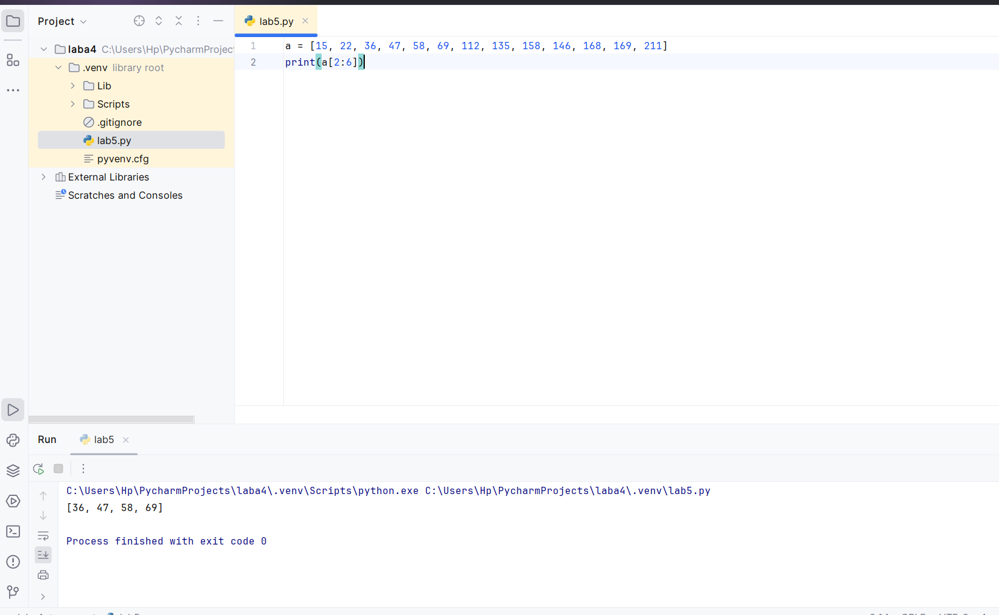
## Выводы
Выводит срез списка: элементы с индексами от 2 до 5 (6 не включается).
## Лабораторная работа №5
### Иван задумался о поиске «бесполезного» числа, полученного из списка. Суть поиска в следующем: он берет произвольный список чисел, находит самое большое из них, а затем делит его на длину списка. Студент пока не придумал, где может пригодиться подобное значение, но ищет у вас помощи в реализации такой функции useless()
```python
def useless(lst):
    return max(lst) / len(lst)

print(useless([4, 7, 9, 20]))
print(useless([-13.5, 11, 15, 17.5, 48]))
print(useless([44, 56, 78, 89, 12, 45, 67, 32, 69]))
```
### Результат.
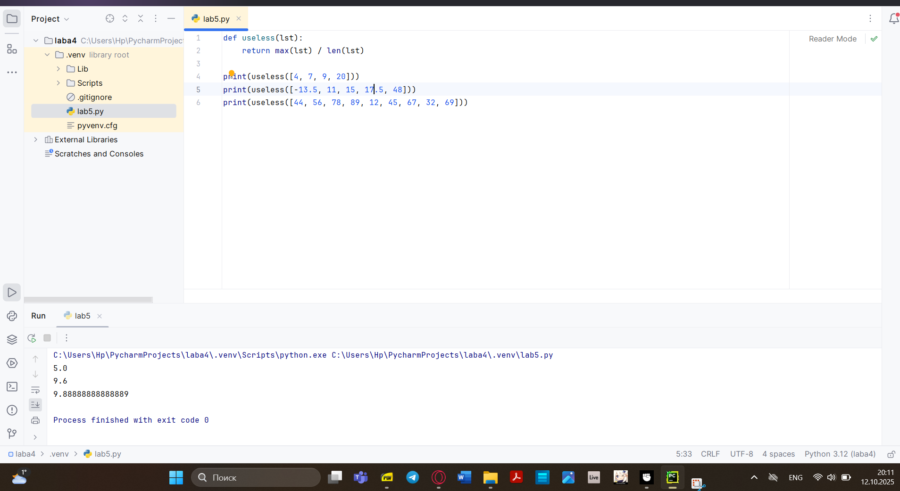
## Выводы
Функция делит максимальный элемент списка на его длину. Возвращает отношение максимума к количеству элементов.

## Лабораторная работа №6
### Ребята не могут определится каким супергероем они хотят стать. У них есть случайно составленный список супергероев, и вы должны определить кто из ребят будет каким супергероем. Необходимо использовать разделение списков.
```python
superheroes = ['ironman', 'superman', 'antman']

vasya, vlad, valera = superheroes
print("Вася -", vasya)
print( "Валера -", valera)
print( "Влад - ", vlad)

```
### Результат.
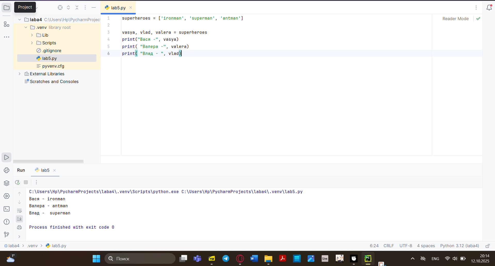
## Выводы
Распаковывает список из 3 элементов в 3 переменные. Количество переменных должно совпадать с длиной списка.

## Лабораторная работа №7
### Вовочка, насмотревшись передачи “Слабое звено” решил написать программу, которая также будет находить самое слабое звено (минимальный элемент) и удалять его, только делать он это хочет не с людьми, а со списком. Помогите Вовочке с реализацией программы. Подсказка: для этого вам необходимо отсортировать список и удалить значение при помощи pop().
```python
a = [-92, -58, 69, -2, 55, 42, 31, - 15, 67, -34, 169]
a.sort()
print('Отсортированный список:\n', a)
a.pop(0)
print('Без наименьшего элемента:\n', a)
```
### Результат.
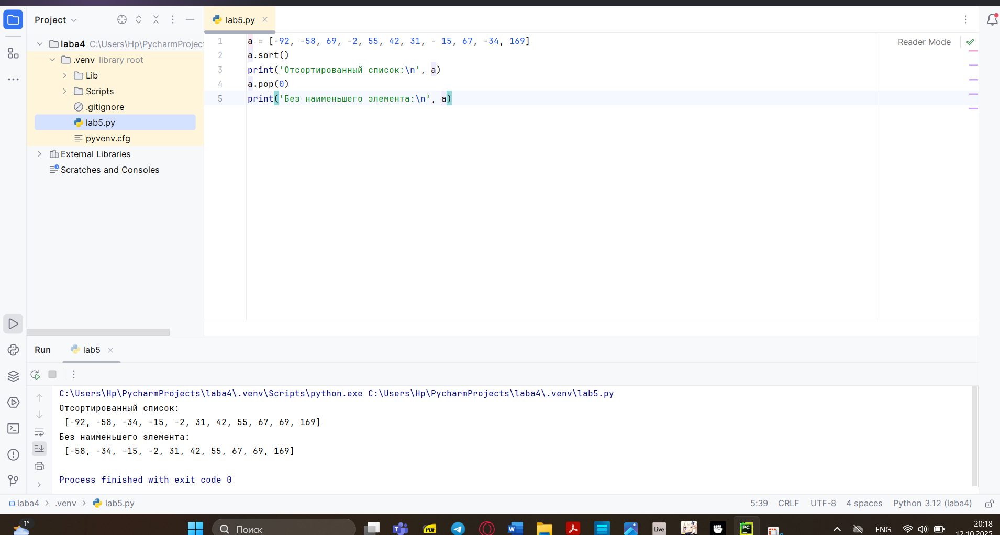
## Выводы
a = [-92, -58, 69, -2, 55, 42, 31, - 15, 67, -34, 169]
a.sort()
print('Отсортированный список:\n', a)
a.pop(0)
print('Без наименьшего элемента:\n', a)

## Лабораторная работа №8
### Михаил решил создать большой n-мерный список, для этого он случайным образом создал несколько списков, состоящих минимум из 3, а максимум из 10 элементов и поместил их в один большой список. Он также как и Иван не знает зачем ему это сейчас нужно, но надеется на то, что это пригодится ему в будущем.
```python
from random import randint
def list_maker():
    a = [randint(1, 100)] * randint(3, 10)
    return a
if __name__ == '__main__':
    result = []
    for i in range(randint(1, 5)):
        result.append(list_maker())
        print(result)
```
### Результат.
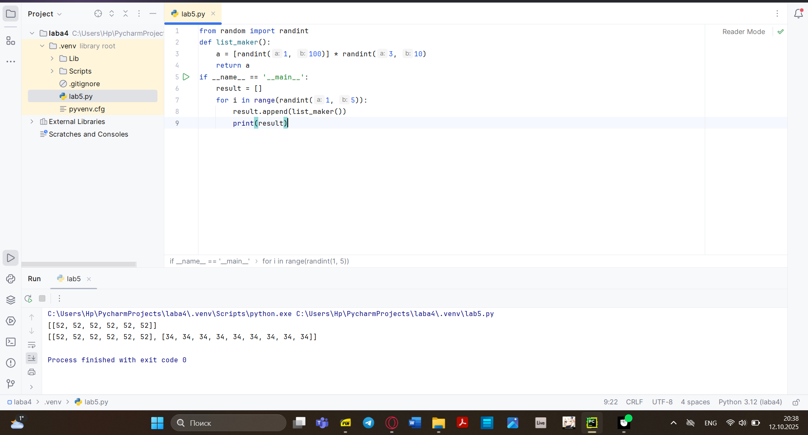
## Выводы
Создает список со случайным числом (3-10) одинаковых случайных элементов (1-100), повторяет это случайное количество раз (1-5).

## Лабораторная работа №9
### Вы работаете в ресторане и отвечает за статистику покупок, ваша задача сравнить между собой заказы покупателей, которые указаны в разном порядке. Реализуйте функцию superset(), которая принимает 2 множества. Результат работы функции: вывод в консоль одного из сообщений в зависимости от ситуации: 1 - «Супермножество не обнаружено» 2 – «Объект {X} является чистым супермножеством» 3 – «Множества равны»
```python
def superset(set_1, set_2):
    if set_1 > set_2:
        print(f'Объект {set_1} является чистым супермножеством')
    elif set_1 == set_2:
        print(f'Множества равны')
    elif set_1 < set_2:
        print(f'Объект {set_2} является чистым супермножеством')
    else:
        print(f'Супермножество не обнаружено')

if __name__ == '__main__':
    superset({1, 2, 5, 7}, {6, 9})
    superset({1, 2, 5, 7}, {5, 3, 8 ,2})
    superset({3, 5}, {5, 3, 8, 1})
    superset({69, 100}, {1, 2})
```
### Результат.
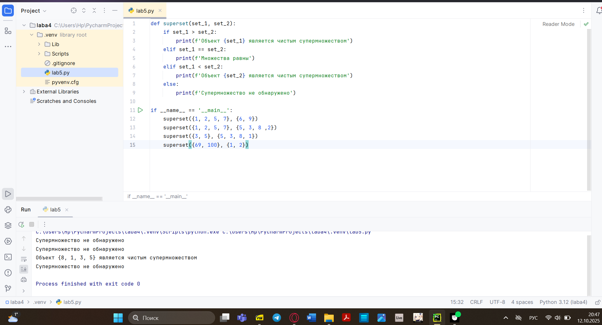
## Выводы
Сравнивает два множества операторами >, <, == для проверки отношений супермножества/подмножества.

## Лабораторная работа №10
### Предположим, что вам нужно разобрать стопку бумаг, но нужно начать работу с нижней, “переверните стопку”. Вам дан произвольный список. Представьте его в обратном порядке. Программа должна занимать не более двух строк в редакторе кода
```python
mylist = [4, 6, 8, 9, 11]
print(mylist[::-1])
```
### Результат.
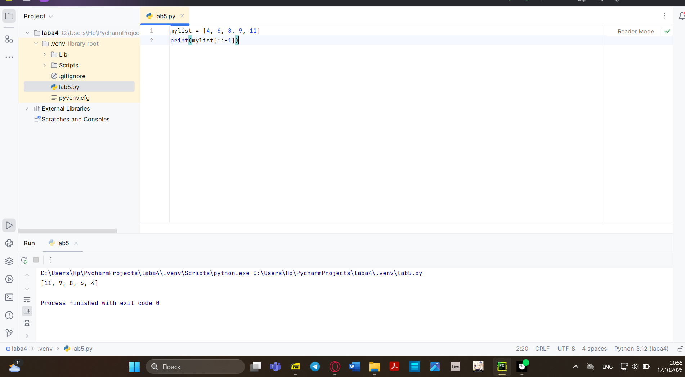
## Выводы
Разворачивает список в обратном порядке через срез [::-1] с шагом -1.

## Самостоятельная работа №1
### Ресторан на предприятии ведет учет посещений за неделю при помощи кода работника. У них есть список со всеми посещениями за неделю. Ваша задача почитать: • Сколько было выдано чеков • Сколько разных людей посетило ресторан • Какой работник посетил ресторан больше всех раз Список выданных чеков за неделю: [8734, 2345, 8201, 6621, 9999, 1234, 5678, 8201, 8888, 4321, 3365, 1478, 9865, 5555, 7777, 9998, 1111, 2222, 3333, 4444, 5556, 6666, 5410, 7778, 8889, 4445, 1439, 9604, 8201, 3365, 7502, 3016, 4928, 5837, 8201, 2643, 5017, 9682, 8530, 3250, 7193, 9051, 4506, 1987, 3365, 5410, 7168, 7777, 9865, 5678, 8201, 4445, 3016, 4506, 4506] Результатом выполнения задачи будет: листинг кода, и вывод в консоль, в котором будет указана вся необходимая информация.
```python
checks = [8734, 2345, 8201, 6621, 9999, 1234, 5678, 8201, 8888, 4321, 3365, 1478, 9865, 5555, 7777, 9998, 1111, 2222, 3333, 4444, 5556, 6666, 5410, 7778, 8889, 4445, 1439, 9604, 8201, 3365, 7502, 3016, 4928, 5837, 8201, 2643, 5017, 9682, 8530, 3250, 7193, 9051, 4506, 1987, 3365, 5410, 7168, 7777, 9865, 5678, 8201, 4445, 3016, 4506, 4506]
total_checks = len(checks)
unique_people = len(set(checks))
from collections import Counter
visits_count = Counter(checks)
most_frequent_worker, max_visits = visits_count.most_common(1)[0]

print("результаты анализа посещений ресторана за неделю:")
print(f"всего выдано чеков: {total_checks}")
print(f"разных людей посетило ресторан: {unique_people}")
print(f"сотрудник с кодом {most_frequent_worker} посетил ресторан больше всех раз: {max_visits} раз(а)")
print("\nтоп 5 самых частых посетителей:")
for worker, count in visits_count.most_common(5):
    print(f"код сотрудника: {worker}, посещений: {count}")

```
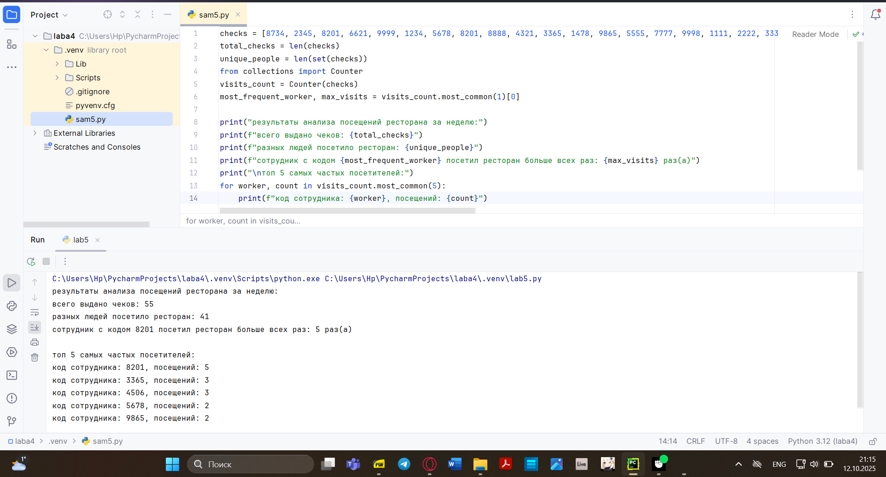
## Выводы
Анализ посещений ресторана. Подсчитывает общее количество чеков, уникальных посетителей и находит самого частого гостя с помощью Counter. Выводит топ-5 посетителей.

## Самостоятельная работа №2
### На физкультуре студенты сдавали бег, у преподавателя физкультуры есть список всех результатов, ему нужно узнать • Три лучшие результата • Три худшие результата • Все результаты начиная с 10 Ваша задача помочь ему в этом. Список результатов бега: [10.2, 14.8, 19.3, 22.7, 12.5, 33.1, 38.9, 21.6, 26.4, 17.1, 30.2, 35.7, 16.9, 27.8, 24.5, 16.3, 18.7, 31.9, 12.9, 37.4] Результатом выполнения задачи будет: листинг кода, и вывод в консоль, в котором будет указана вся необходимая информация.
```python
results = [10.2, 14.8, 19.3, 22.7, 12.5, 33.1, 38.9, 21.6, 26.4, 17.1, 30.2, 35.7, 16.9, 27.8, 24.5, 16.3, 18.7, 31.9, 12.9, 37.4]
sorted_results = sorted(results)

print("Анализ результатов бега:")
print(f"Все результаты: {results}")
print()

print("Три лучших результата:")
best_results = sorted_results[:3]
for i, result in enumerate(best_results, 1):
    print(f"{i} место: {result} сек")
print()

print("Три худшие результата:")
worst_results = sorted_results[-3:]
for i, result in enumerate(worst_results[::-1], 1):
    print(f"{i} место с конца: {result} сек")

print()

print("Все результаты начиная с 10-го:")
results_from_10th = sorted_results[9:]
for i, result in enumerate(results_from_10th, 10):
    print(f"{i} результат: {result} сек")

print()

```
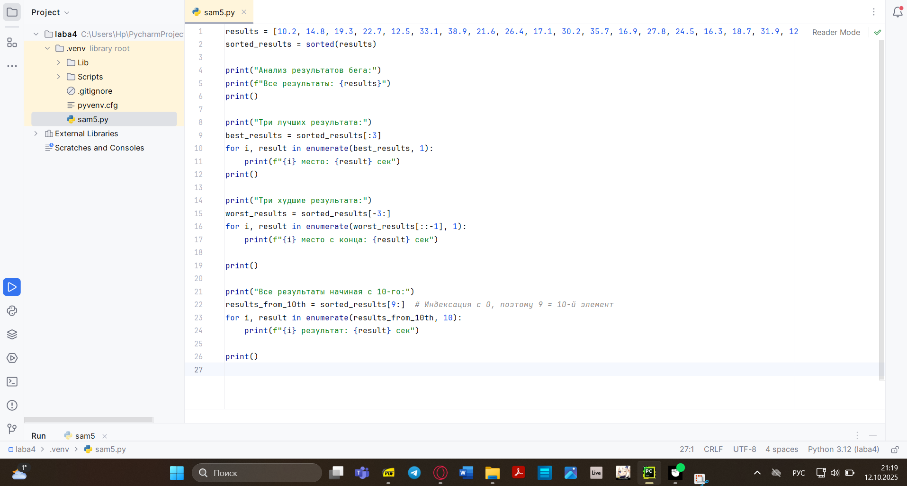
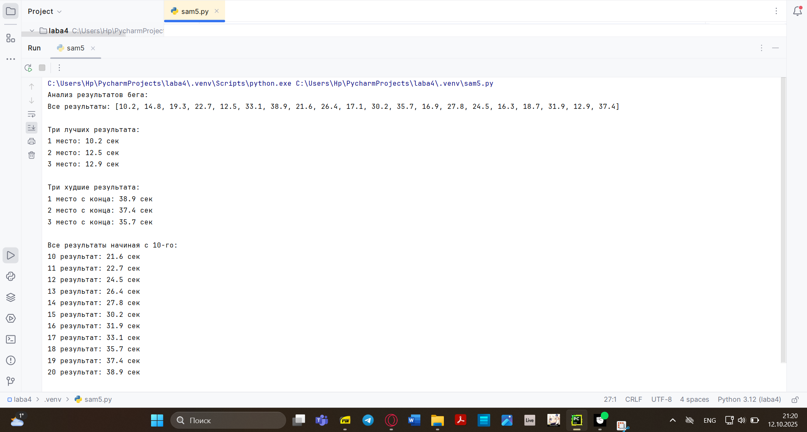
## Выводы
Анализ результатов бега. Сортирует результаты, находит 3 лучших (минимальное время), 3 худших (максимальное время) и все результаты начиная с 10-й позиции в отсортированном списке.

## Самостоятельная работа №3
### Преподаватель по математике придумал странную задачку. У вас есть три списка с элементами, каждый элемент которых – длина стороны треугольника, ваша задача найти площади двух треугольников, составленные из максимальных и минимальных элементов полученных списков. Результатом выполнения задачи будет: листинг кода, и вывод в консоль, в котором будут указаны два этих значения. Три списка: one = [12, 25, 3, 48, 71] two = [5, 18, 40, 62, 98] three = [4, 21, 37, 56, 84]
```python
import math
one = [12, 25, 3, 48, 71]
two = [5, 18, 40, 62, 98]
three = [4, 21, 37, 56, 84]

print("Исходные списки:")
print(f"one = {one}")
print(f"two = {two}")
print(f"three = {three}")
print()

min_a = min(one)
min_b = min(two)
min_c = min(three)

max_a = max(one)
max_b = max(two)
max_c = max(three)

print("Минимальные элементы:")
print(f"min(one) = {min_a}, min(two) = {min_b}, min(three) = {min_c}")
print("Максимальные элементы:")
print(f"max(one) = {max_a}, max(two) = {max_b}, max(three) = {max_c}")
print()

def calculate_triangle_area(a, b, c):
    if a + b > c and a + c > b and b + c > a:
        p = (a + b + c) / 2
        area = math.sqrt(p * (p - a) * (p - b) * (p - c))
        return area
    else:
        return None
area_min = calculate_triangle_area(min_a, min_b, min_c)
area_max = calculate_triangle_area(max_a, max_b, max_c)
print("РЕЗУЛЬТАТЫ:")
if area_min is not None:
    print(f"Площадь треугольника из минимальных элементов ({min_a}, {min_b}, {min_c}): {area_min:.2f}")
else:
    print(f"Из минимальных элементов ({min_a}, {min_b}, {min_c}) нельзя составить треугольник")

if area_max is not None:
    print(f"Площадь треугольника из максимальных элементов ({max_a}, {max_b}, {max_c}): {area_max:.2f}")
else:
    print(f"Из максимальных элементов ({max_a}, {max_b}, {max_c}) нельзя составить треугольник")
```
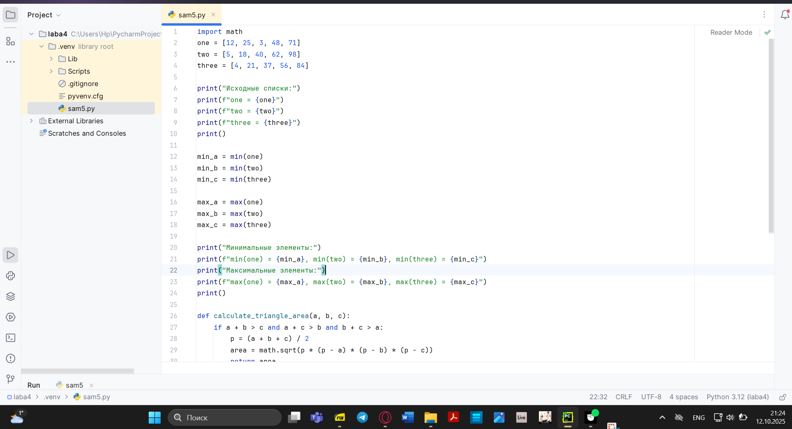
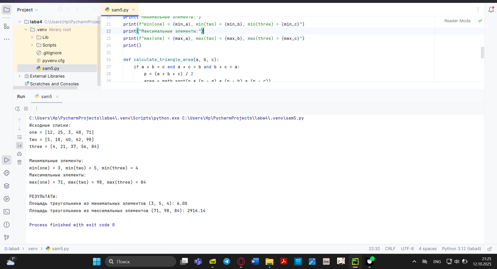
## Выводы
Вычисление площадей треугольников. Берет минимальные и максимальные элементы из трех списков, проверяет возможность построения треугольника и вычисляет площадь по формуле Герона.

## Самостоятельная работа №4
### Никто не любит получать плохие оценки, поэтому Борис решил это исправить. Допустим, что все оценки студента за семестр хранятся в одном списке. Ваша задача удалить из этого списка все двойки, а все тройки заменить на четверки. Списки оценок (проверить работу программы на всех трех вариантах): [2, 3, 4, 5, 3, 4, 5, 2, 2, 5, 3, 4, 3, 5, 4] [4, 2, 3, 5, 3, 5, 4, 2, 2, 5, 4, 3, 5, 3, 4] [5, 4, 3, 3, 4, 3, 3, 5, 5, 3, 3, 3, 3, 4, 4] Результатом выполнения задачи будет: листинг кода, и вывод в консоль, в котором будут три обновленных массива
```python
def improve_grades(grades):
    improved = []
    for grade in grades:
        if grade == 2:
            continue
        elif grade == 3:
            improved.append(4)
        else:
            improved.append(grade)
    return improved

grades_list_1 = [2, 3, 4, 5, 3, 4, 5, 2, 2, 5, 3, 4, 3, 5, 4]
grades_list_2 = [4, 2, 3, 5, 3, 5, 4, 2, 2, 5, 4, 3, 5, 3, 4]
grades_list_3 = [5, 4, 3, 3, 4, 3, 3, 5, 5, 3, 3, 3, 3, 4, 4]

print("\n1) Первый список оценок:")
print(f"Исходные оценки: {grades_list_1}")
improved_1 = improve_grades(grades_list_1)
print(f"Улучшенные оценки: {improved_1}")
print(f"Статистика: было {len(grades_list_1)} оценок, стало {len(improved_1)} оценок")
print(f"Удалено двоек: {grades_list_1.count(2)}, заменено троек: {grades_list_1.count(3)}")

print("\n2) Второй список оценок:")
print(f"Исходные оценки: {grades_list_2}")
improved_2 = improve_grades(grades_list_2)
print(f"Улучшенные оценки: {improved_2}")
print(f"Статистика: было {len(grades_list_2)} оценок, стало {len(improved_2)} оценок")
print(f"Удалено двоек: {grades_list_2.count(2)}, заменено троек: {grades_list_2.count(3)}")

print("\n3) Третий список оценок:")
print(f"Исходные оценки: {grades_list_3}")
improved_3 = improve_grades(grades_list_3)
print(f"Улучшенные оценки: {improved_3}")
print(f"Статистика: было {len(grades_list_3)} оценок, стало {len(improved_3)} оценок")
print(f"Удалено двоек: {grades_list_3.count(2)}, заменено троек: {grades_list_3.count(3)}")

```
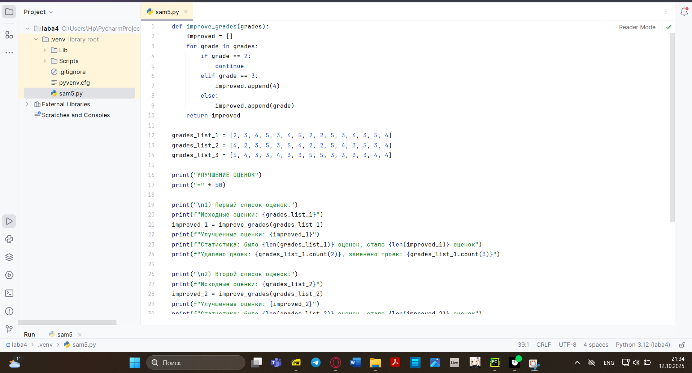
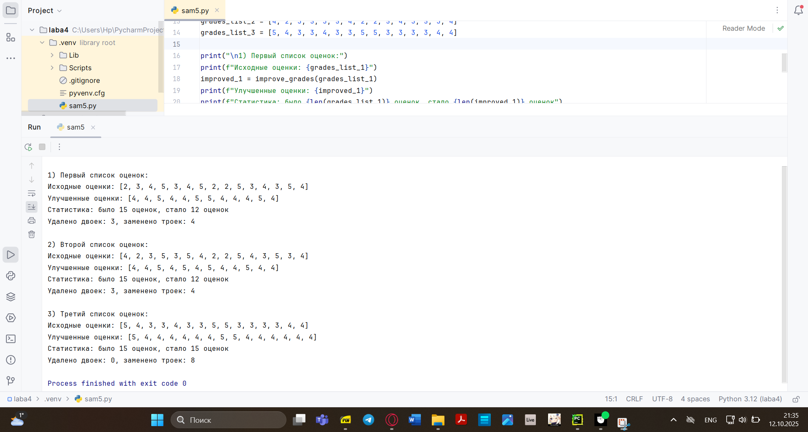
## Выводы
"Улучшение" оценок. Удаляет все двойки из списка, заменяет все тройки на четверки. Выводит статистику по изменениям для трех разных наборов оценок.

## Самостоятельная работа №5
### Вам предоставлены списки натуральных чисел, из них необходимо сформировать множества. При этом следует соблюдать это правило: если какое-либо число повторяется, то преобразовать его в строку по следующему образцу: например, если число 4 повторяется 3 раза, то в множестве будет следующая запись: само число 4, строка «44», строка «444». Множества для теста: list_1 = [1, 1, 3, 3, 1] list_2 = [5, 5, 5, 5, 5, 5, 5] list_3 = [2, 2, 1, 2, 2, 5, 6, 7, 1, 3, 2, 2] Результаты вывода (порядок может отличаться, поскольку мы работаем с set()): {'11', 1, 3, '33', '111'} {5, '5555', '555555', '55555', '555', '55', '5555555'} {'11', 1, 3, 2, 5, 6, '222222', '222', 7, '2222', '22222', '22'}
```python
def create_special_set(numbers):
    from collections import Counter
    count_dict = Counter(numbers)
    result_set = set()

    for num, count in count_dict.items():
        result_set.add(num)
        for i in range(2, count + 1):
            result_set.add(str(num) * i)

    return result_set
list_1 = [1, 1, 3, 3, 1]
list_2 = [5, 5, 5, 5, 5, 5, 5]
list_3 = [2, 2, 1, 2, 2, 5, 6, 7, 1, 3, 2, 2]
print("\n1) Первый список:")
print(f"Исходный список: {list_1}")
set_1 = create_special_set(list_1)
print(f"Результирующее множество: {set_1}")

print("\n2) Второй список:")
print(f"Исходный список: {list_2}")
set_2 = create_special_set(list_2)
print(f"Результирующее множество: {set_2}")

print("\n3) Третий список:")
print(f"Исходный список: {list_3}")
set_3 = create_special_set(list_3)
print(f"Результирующее множество: {set_3}")

```
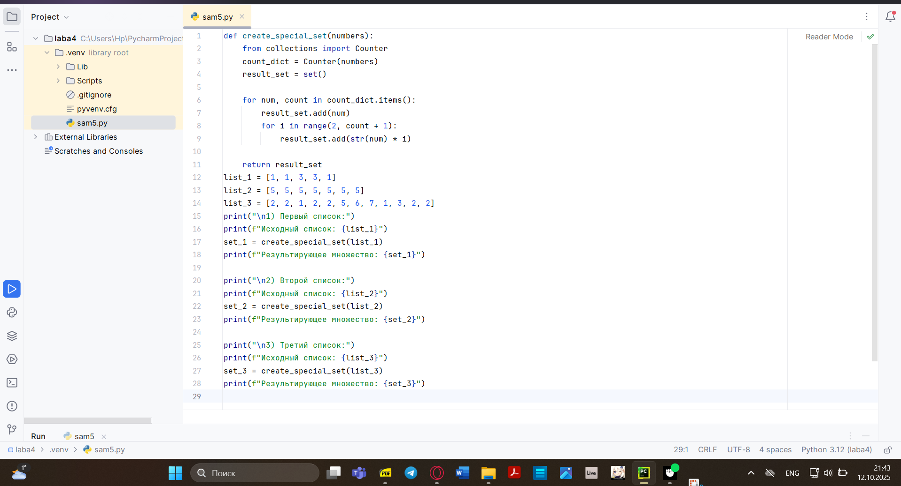
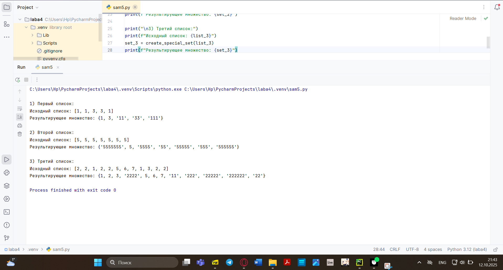
## Выводы
Создание специальных множеств. Для каждого числа, которое повторяется n раз, добавляет в множество: само число, его строковое представление из 2, 3, ..., n повторений. Использует Counter для подсчета повторений.

## Общие выводы по теме
ОБЩИЙ ВЫВОД ПО ЛАБОРАТОРНОЙ РАБОТЕ

Основные темы, изученные в работе:
Работа со списками (lists) - базовые операции: сортировка, срезы, добавление/удаление элементов, поиск min/max
Множества (sets) - создание, операции над множествами (разность), особенности изменяемых и неизменяемых (frozenset) множеств
Анализ данных - обработка статистической информации: подсчет частот, нахождение экстремумов, фильтрация данных
Функции - создание пользовательских функций для решения конкретных задач
Модули - использование стандартных модулей Python (collections, math, random)

Ключевые навыки, полученные при выполнении заданий:
Обработка и анализ реальных данных (посещения ресторана, результаты бега, оценки студентов)
Решение геометрических задач с проверкой условий (треугольник)
Фильтрация и преобразование данных по заданным правилам
Работа с коллекциями различного типа (списки, множества, счетчики)
Визуализация результатов анализа через консольный вывод

Практическая значимость:
Работа демонстрирует применение структур данных Python для решения прикладных задач из разных областей - от учета посещений до анализа успеваемости и спортивных результатов.