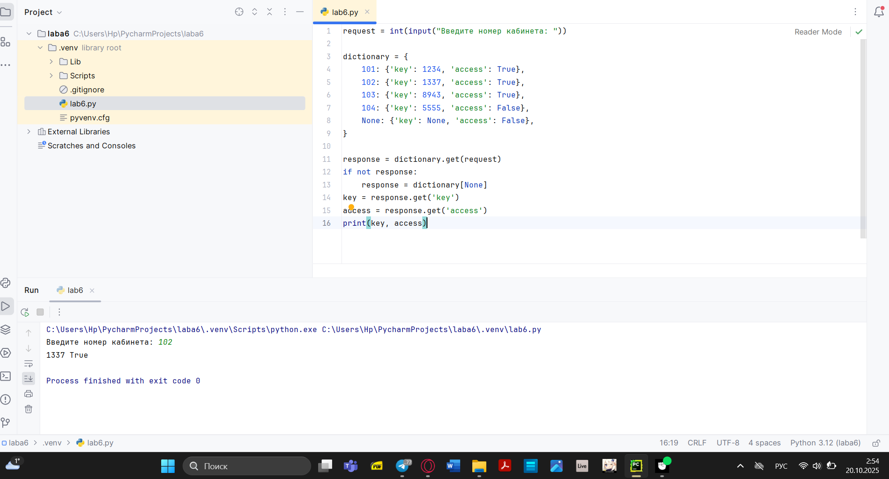
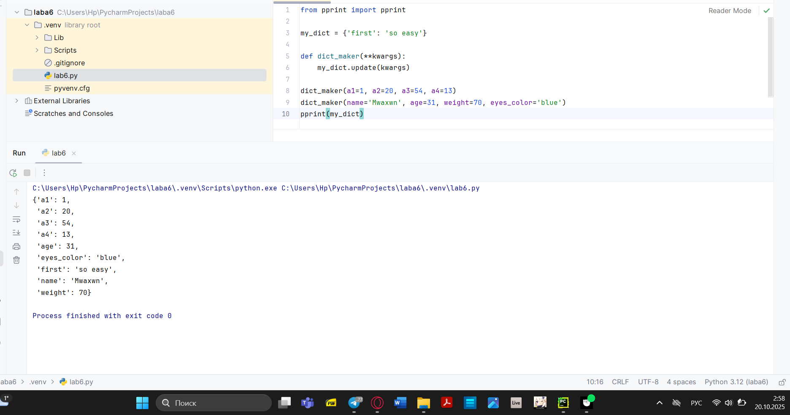
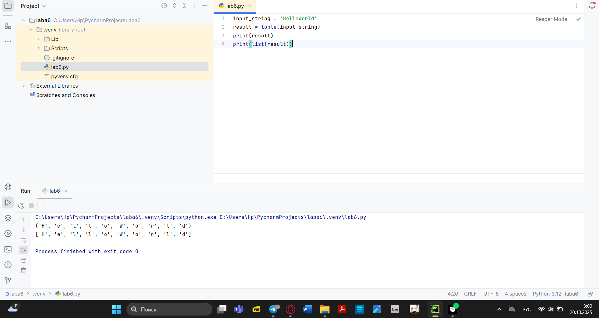
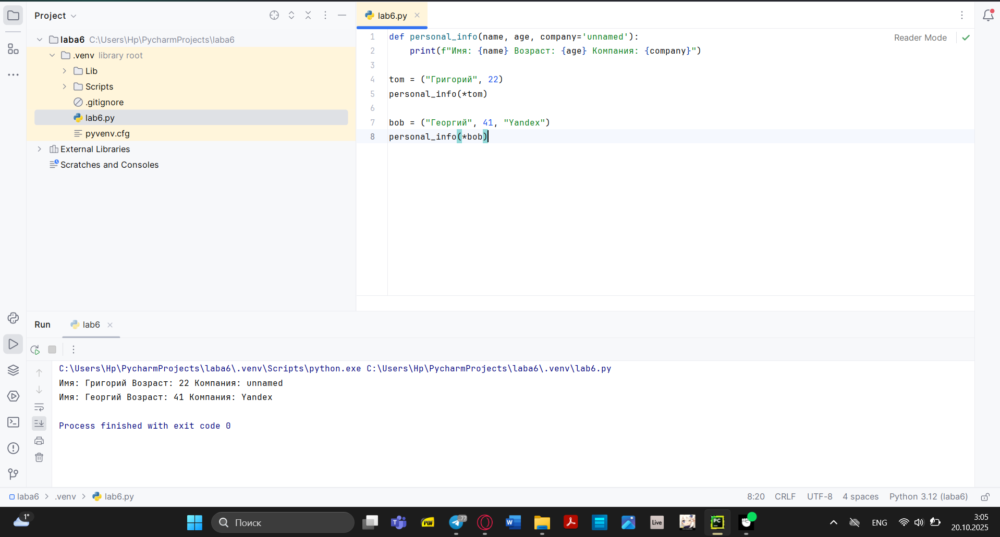
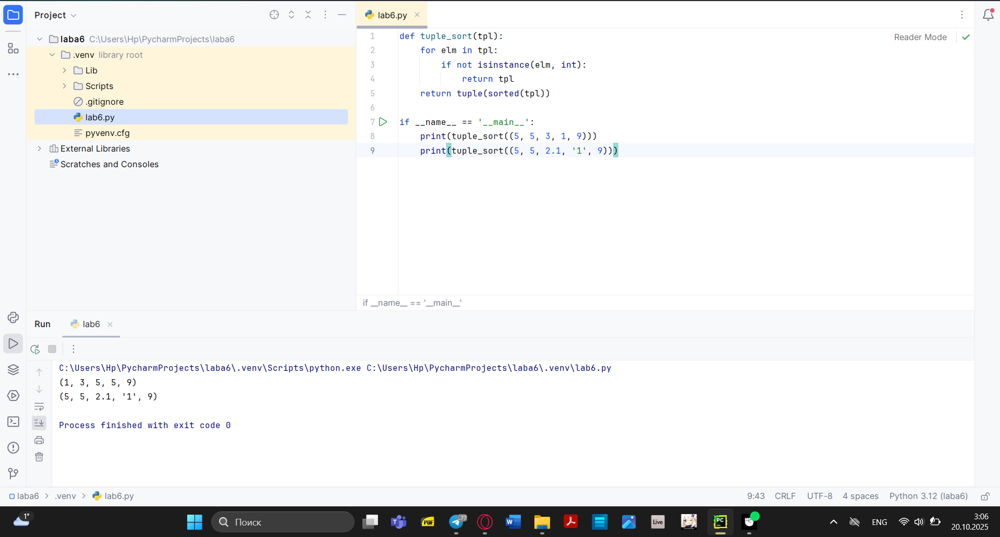
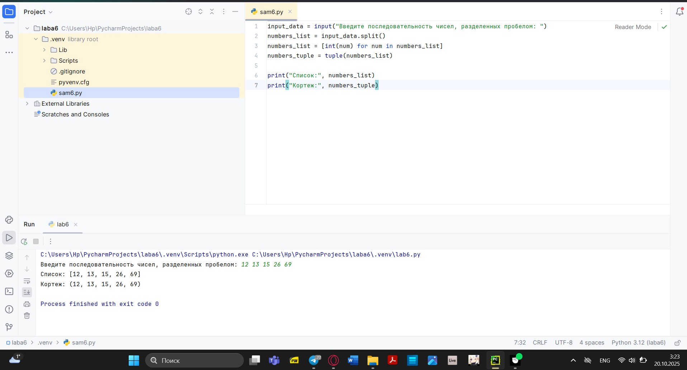
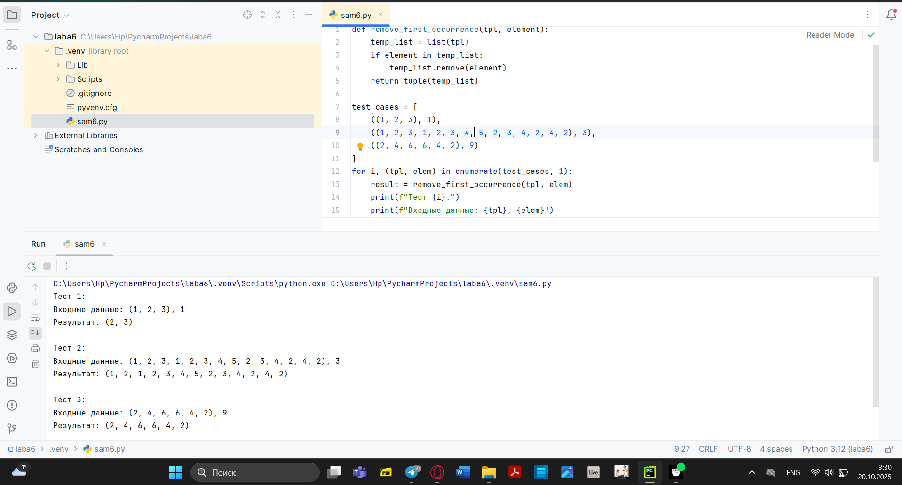
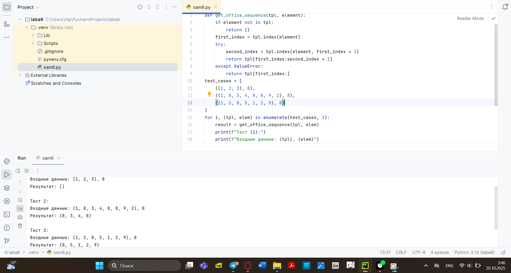
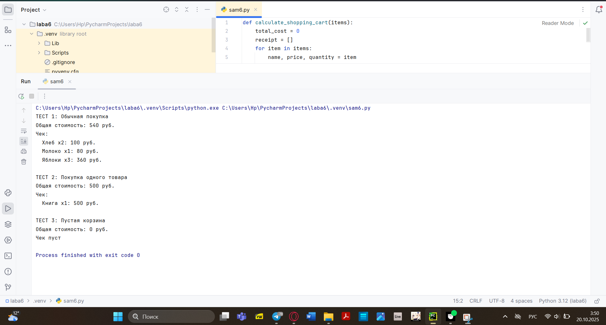

# Тема 6. Базовые коллекции: Словари, кортежи
Отчет по Теме #6 выполнил(а):
- Хайрутдинов Линар Рустамович
- АИС-23-1

| Задание | Лаб_раб | Сам_раб |
| ------ | ------ | ------ |
| Задание 1 | + | + |
| Задание 2 | + | + |
| Задание 3 | + | + |
| Задание 4 | + | + |
| Задание 5 | + | + |

знак "+" - задание выполнено; знак "-" - задание не выполнено;


## Лабораторная работа №1
### В школе, где вы учились, узнали, что вы крутой программист и попросили написать программу для учителей, которая будет при вводе кабинета писать для него ключ доступа и статус, занят кабинет или нет. При написании программы необходимо использовать словарь (dict), который на вход получает номер кабинета, а выводит необходимую информацию. Если кабинета, который вы ввели нет в словаре, то в консоль в виде значения ключа нужно вывести “None” и виде статуса вывести “False”. По большому счету написав данную программу мы с вами научились заменять иногда громоздкую конструкцию if/elif/else. Поскольку здесь функционал словаря полностью повторяет функционал условия, но при этом у использования словарей в более сложных программах есть намного больше возможностей реализации

```python
request = int(input("Введите номер кабинета: "))

dictionary = {
    101: {'key': 1234, 'access': True},
    102: {'key': 1337, 'access': True},
    103: {'key': 8943, 'access': True},
    104: {'key': 5555, 'access': False},
    None: {'key': None, 'access': False},
}

response = dictionary.get(request)
if not response:
    response = dictionary[None]
key = response.get('key')
access = response.get('access')
print(key, access)
```
### Результат.


## Выводы
Программа для проверки доступа к кабинетам. Пользователь вводит номер кабинета, программа возвращает код доступа и статус разрешения. Использует словарь для хранения информации о кабинетах.

## Лабораторная работа №2
### Алексей решил создать самый большой словарь в мире. Для этого он придумал функцию dict_maker (**kwargs), которая принимает неограниченное количество параметров «ключ: значение» и обновляет созданный им словарь my_dict, состоящий всего из одного элемента «first» со значением «so easy». Помогите Алексею создать данную функцию. Ниже на скриншоте мы использовали встроенный модуль pprint, который выводит большие объемы информации более понятно для восприятия человеческим глазом. Иногда очень удобно использовать данную возможность Python
```python
from pprint import pprint

my_dict = {'first': 'so easy'}

def dict_maker(**kwargs):
    my_dict.update(kwargs)

dict_maker(a1=1, a2=20, a3=54, a4=13)
dict_maker(name='Mwaxwn', age=31, weight=70, eyes_color='blue')
pprint(my_dict)
```

### Результат.

## Выводы
Демонстрация работы с функциями, принимающими произвольные именованные аргументы (**kwargs). Функция dict_maker добавляет переданные параметры в существующий словарь.

## Лабораторная работа №3
### Для решения некоторых задач бывает необходимо разложить строку на отдельные символы. Мы знаем что это можно сделать при помощи split(), у которого более гибкая настройка для разделения для этого, но если нам нужно посимвольно разделить строку без всяких условий, то для этого мы можем использовать кортежи (tuple). Для этого напишем любую строку, которую будем делить и “обвернем” ее в tuple и дальше мы можем как нам угодно с ней работать, например, сделать ее списком (тогда получится полный аналог split()) или же работать с ним дальше, как с кортежем
```python
input_string = 'HelloWorld'
result = tuple(input_string)
print(result)
print(list(result))
```
### Результат.

## Выводы
Преобразование строки в кортеж и список. Показывает разницу между этими двумя типами коллекций - кортеж (неизменяемый) и список (изменяемый).

## Лабораторная работа №4
### Вовочка решил написать крутую функцию, которая будет писать имя, возраст и место работы, но при этом на вход этой функции будет поступать кортеж. Помогите Вовочке написать эту программу.
```python
def personal_info(name, age, company='unnamed'):
    print(f"Имя: {name} Возраст: {age} Компания: {company}")
tom = ("Григорий", 22)
personal_info(*tom)
bob = ("Георгий", 41, "Yandex")
personal_info(*bob)
```
### Результат.

## Выводы
Пример распаковки кортежей при вызове функции. Показывает, как передавать параметры в функцию с помощью оператора *, а также использование значений по умолчанию.

## Лабораторная работа №5
### Для сопровождения первых лиц государства X нужен кортеж, но никто не может определиться с порядком машин, поэтому вам нужно написать функцию, которая будет сортировать кортеж, состоящий из целых чисел по возрастанию, и возвращает его. Если хотя бы один элемент не является целым числом, то функция возвращает исходный кортеж
```python
def tuple_sort(tpl):
    for elm in tpl:
        if not isinstance(elm, int):
            return tpl
    return tuple(sorted(tpl))

if __name__ == '__main__':
    print(tuple_sort((5, 5, 3, 1, 9)))
    print(tuple_sort((5, 5, 2.1, '1', 9)))
```
### Результат.

## Выводы
Функция для сортировки кортежа, но только если все элементы являются целыми числами. Если в кортеже есть не-целые числа, возвращает исходный кортеж без изменений.

## Самостоятельная работа №1
### При создании сайта у вас возникла потребность обрабатывать данные пользователя в странной форме, а потом переводить их в нужные вам форматы. Вы хотите принимать от пользователя последовательность чисел, разделенных пробелом, а после переформатировать эти данные в список и кортеж. Реализуйте вашу задумку. Для получения начальных данных используйте input(). Результатом программы будет выведенный список и кортеж из начальных данных.
```python
input_data = input("Введите последовательность чисел, разделенных пробелом: ")
numbers_list = input_data.split()
numbers_list = [int(num) for num in numbers_list]
numbers_tuple = tuple(numbers_list)

print("Список:", numbers_list)
print("Кортеж:", numbers_tuple)

```

## Выводы
Преобразует введенную пользователем строку чисел в список и кортеж. Демонстрирует базовые операции преобразования типов данных и работу с коллекциями.

## Самостоятельная работа №2
### Николай знает, что кортежи являются неизменяемыми, но он очень упрямый и всегда хочет доказать, что он прав. Студент решил создать функцию, которая будет удалять первое появление определенного элемента из кортежа по значению и возвращать кортеж без него. Попробуйте повторить шедевр не признающего авторитеты начинающего программиста. Но учтите, что Николай не всегда уверен в наличии элемента в кортеже (в этом случае кортеж вернется функцией в исходном виде). Входные данные: (1, 2, 3), 1) (1, 2, 3, 1, 2, 3, 4, 5, 2, 3, 4, 2, 4, 2), 3) (2, 4, 6, 6, 4, 2), 9) Ожидаемый результат: (2, 3) (1, 2, 1, 2, 3, 4, 5, 2, 3, 4, 2, 4, 2) (2, 4, 6, 6, 4, 2).
```python
def remove_first_occurrence(tpl, element):
    temp_list = list(tpl)
    if element in temp_list:
        temp_list.remove(element)
    return tuple(temp_list)

test_cases = [
    ((1, 2, 3), 1),
    ((1, 2, 3, 1, 2, 3, 4, 5, 2, 3, 4, 2, 4, 2), 3),
    ((2, 4, 6, 6, 4, 2), 9)
]
for i, (tpl, elem) in enumerate(test_cases, 1):
    result = remove_first_occurrence(tpl, elem)
    print(f"Тест {i}:")
    print(f"Входные данные: {tpl}, {elem}")
    print(f"Результат: {result}")
    print()

```

## Выводы
Удаляет первое вхождение элемента из кортежа. Показывает работу с неизменяемыми коллекциями через преобразование в список и обратно.

## Самостоятельная работа №3
### Ребята поспорили кто из них одним нажатием на numpad наберет больше повторяющихся цифр, но не понимают, как узнать победителя. Вам им нужно в этом помочь. Дана строка в виде случайной последовательности чисел от 0 до 9 (длина строки минимум 15 символов). Требуется создать словарь, который в качестве ключей будет принимать данные числа (т. е. ключи будут типом int), а в качестве значений – количество этих чисел в имеющейся последовательности. Для построения словаря создайте функцию, принимающую строку из цифр. Функция должна возвратить словарь из 3-х самых часто встречаемых чисел, также эти значения нужно вывести в порядке возрастания ключа
```python
def count_digits(sequence):
    digit_count = {}
    for char in sequence:
        if char.isdigit():
            digit = int(char)
            digit_count[digit] = digit_count.get(digit, 0) + 1
    sorted_digits = sorted(digit_count.items(), key=lambda x: (-x[1], x[0]))
    top_three = sorted_digits[:3]
    top_three_sorted = sorted(top_three, key=lambda x: x[0])
    result_dict = dict(top_three)
    print("Топ-3 самых часто встречаемых чисел (в порядке возрастания ключа):")
    for digit, count in top_three_sorted:
        print(f"Цифра {digit}: {count} раз(а)")
    return result_dict
def main():
    test_sequence = "123456789012345678901234567890"
    if len(test_sequence) < 15:
        print("Строка слишком короткая! Минимум 15 символов.")
        return
    print(f"Исходная последовательность: {test_sequence}")
    print(f"Длина последовательности: {len(test_sequence)} символов")
    result = count_digits(test_sequence)
    print("Словарь с топ-3 самыми частыми цифрами:")
    print(result)
def additional_tests():
    test_cases = [
        "111222333444555666777",
        "123123123456456456789",
        "000111222333444555666",
    ]
    for i, sequence in enumerate(test_cases, 1):
        print(f"\nТест {i}:")
        print(f"Последовательность: {sequence}")
        result = count_digits(sequence)
        print(f"Результат: {result}")
if __name__ == "__main__":
    main()
    additional_tests()
```

## Выводы
Анализирует строку цифр и находит 3 самые частые цифры. Демонстрирует сложную работу со словарями, сортировкой и обработкой статистики.

## Самостоятельная работа №4
### Ваш хороший друг владеет офисом со входом по электронным картам, ему нужно чтобы вы написали программу, которая показывала в каком порядке сотрудники входили и выходили из офиса. Определение сотрудника происходит по id. Напишите функцию, которая на вход принимает кортеж и случайный элемент (id), его можно придумать самостоятельно. Требуется вернуть новый кортеж, начинающийся с первого появления элемента в нем и заканчивающийся вторым его появлением включительно. Если элемента нет вовсе – вернуть пустой кортеж. Если элемент встречается только один раз, то вернуть кортеж, который начинается с него и идет до конца исходного. Входные данные: (1, 2, 3), 8) (1, 8, 3, 4, 8, 8, 9, 2), 8) (1, 2, 8, 5, 1, 2, 9), 8) Ожидаемый результат: () (8, 3, 4, 8) (8, 5, 1, 2, 9)
```python
def get_office_sequence(tpl, element):
    if element not in tpl:
        return ()
    first_index = tpl.index(element)
    try:
        second_index = tpl.index(element, first_index + 1)
        return tpl[first_index:second_index + 1]
    except ValueError:
        return tpl[first_index:]
test_cases = [
    ((1, 2, 3), 8),
    ((1, 8, 3, 4, 8, 8, 9, 2), 8),
    ((1, 2, 8, 5, 1, 2, 9), 8)
]
for i, (tpl, elem) in enumerate(test_cases, 1):
    result = get_office_sequence(tpl, elem)
    print(f"Тест {i}:")
    print(f"Входные данные: {tpl}, {elem}")
    print(f"Результат: {result}")
    print()

```

## Выводы
Находит последовательность в кортеже между первым и вторым вхождением элемента. Решает задачу отслеживания перемещений сотрудников по офису.

## Самостоятельная работа №5
### Самостоятельно придумайте и решите задачу, в которой будут обязательно использоваться кортеж или список. Проведите минимум три теста для проверки работоспособности вашей задачи
```python
def calculate_shopping_cart(items):
    total_cost = 0
    receipt = []
    for item in items:
        name, price, quantity = item
        item_total = price * quantity
        total_cost += item_total
        receipt.append((name, quantity, item_total))
    return total_cost, receipt
print("ТЕСТ 1: Обычная покупка")
cart1 = (
    ("Хлеб", 50, 2),
    ("Молоко", 80, 1),
    ("Яблоки", 120, 3)
)
total1, receipt1 = calculate_shopping_cart(cart1)
print(f"Общая стоимость: {total1} руб.")
print("Чек:")
for item in receipt1:
    print(f"  {item[0]} x{item[1]}: {item[2]} руб.")
print("\nТЕСТ 2: Покупка одного товара")
cart2 = (("Книга", 500, 1),)
total2, receipt2 = calculate_shopping_cart(cart2)
print(f"Общая стоимость: {total2} руб.")
print("Чек:")
for item in receipt2:
    print(f"  {item[0]} x{item[1]}: {item[2]} руб.")
print("\nТЕСТ 3: Пустая корзина")
cart3 = ()
total3, receipt3 = calculate_shopping_cart(cart3)
print(f"Общая стоимость: {total3} руб.")
print("Чек пуст" if not receipt3 else "В чеке есть товары")

```

## Выводы
Рассчитывает стоимость покупок в корзине. Показывает практическое применение кортежей для хранения структурированных данных (товаров) и вычислений.

## Общие выводы по теме
Лабораторная работа демонстрирует важность выбора правильной структуры данных для решения конкретных задач. Кортежи обеспечивают безопасность данных благодаря неизменяемости, словари предоставляют гибкость для хранения структурированной информации, а списки удобны для динамических операций.

Работа со словарями:

Хранение структурированных данных (lab6_1.py, lab6_2.py)

Использование методов get() для безопасного доступа

Обработка отсутствующих ключей

Динамическое обновление словарей через **kwargs

Работа с кортежами:

Неизменяемость кортежей (sam6_2.py)

Преобразование между строками, списками и кортежами (lab6_3.py, sam6_1.py)

Распаковка кортежей при вызове функций (lab6_4.py)
